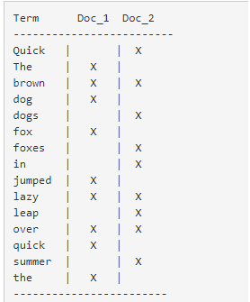
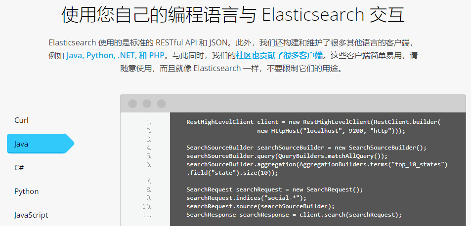
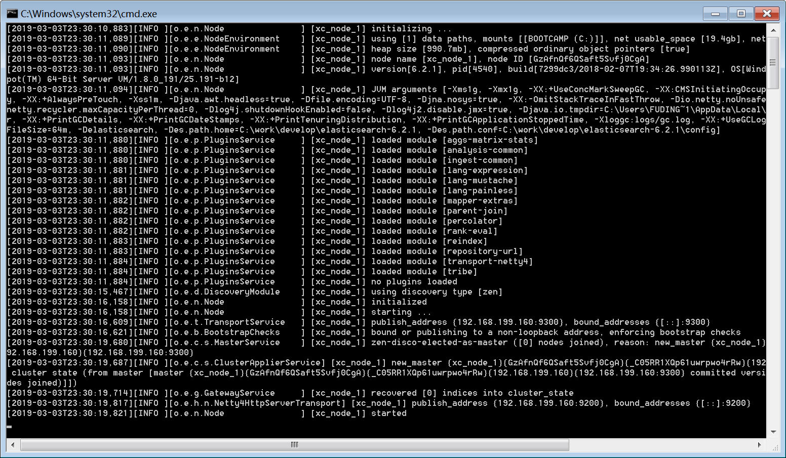

# 全文检索 Elasticearch 研究

# 教学目标

1. 了解Elasticsearch的应用场景
2. 掌握索引维护的方法
3. 掌握基本的搜索Api的使用方法

# 约束

阅读本教程之前需要掌握Lucene的索引方法、搜索方法 。

# 1. ElasticSearch 介绍

## 1.1 介绍

**[Elasticsearch](https://en.wikipedia.org/wiki/Elasticsearch)**是一个基于[Lucene](https://zh.wikipedia.org/wiki/Lucene)库的[搜索引擎](https://zh.wikipedia.org/wiki/%E6%90%9C%E7%B4%A2%E5%BC%95%E6%93%8E)。它提供了一个分布式、支持[多租户](https://zh.wikipedia.org/wiki/%E5%A4%9A%E7%A7%9F%E6%88%B6%E6%8A%80%E8%A1%93)的[全文搜索](https://zh.wikipedia.org/wiki/%E5%85%A8%E6%96%87%E6%AA%A2%E7%B4%A2)引擎，具有[HTTP](https://zh.wikipedia.org/wiki/HTTP) Web接口和无模式[JSON](https://zh.wikipedia.org/wiki/JSON)文档。Elasticsearch是用[Java](https://zh.wikipedia.org/wiki/Java)开发的，并在[Apache许可证](https://zh.wikipedia.org/wiki/Apache%E8%AE%B8%E5%8F%AF%E8%AF%81)下作为开源软件发布。官方客户端在[Java](https://zh.wikipedia.org/wiki/Java)、[.NET](https://zh.wikipedia.org/wiki/.NET%E6%A1%86%E6%9E%B6)（[C#](https://zh.wikipedia.org/wiki/C%E2%99%AF)）、[PHP](https://zh.wikipedia.org/wiki/PHP)、[Python](https://zh.wikipedia.org/wiki/Python)、[Apache Groovy](https://zh.wikipedia.org/wiki/Groovy)、[Ruby](https://zh.wikipedia.org/wiki/Ruby)和许多其他语言中都是可用的。[[5\]](https://zh.wikipedia.org/wiki/Elasticsearch#cite_note-offizsite-5)根据DB-Engines的排名显示，Elasticsearch是最受欢迎的企业搜索引擎，其次是[Apache Solr](https://zh.wikipedia.org/wiki/Apache_Solr)，也是基于Lucene。[[6\]](https://zh.wikipedia.org/wiki/Elasticsearch#cite_note-6)


Elasticsearch是与名为Logstash的数据收集和日志解析引擎以及名为Kibana的分析和可视化平台一起开发的。这三个产品被设计成一个集成解决方案，称为“Elastic Stack”（以前称为“ELK stack”）。

Elasticsearch可以用于搜索各种文档。它提供可扩展的搜索，具有接近实时的搜索，并支持多租户。[[5\]](https://zh.wikipedia.org/wiki/Elasticsearch#cite_note-offizsite-5)”Elasticsearch是分布式的，这意味着索引可以被分成分片，每个分片可以有0个或多个副本。每个节点托管一个或多个分片，并充当协调器将操作委托给正确的分片。再平衡和路由是自动完成的。“[[5\]](https://zh.wikipedia.org/wiki/Elasticsearch#cite_note-offizsite-5)相关数据通常存储在同一个索引中，该索引由一个或多个主分片和零个或多个复制分片组成。一旦创建了索引，就不能更改主分片的数量。[[7\]](https://zh.wikipedia.org/wiki/Elasticsearch#cite_note-7)

Elasticsearch使用Lucene，并试图通过JSON和Java API提供其所有特性。它支持facetting和percolating[[8\]](https://zh.wikipedia.org/wiki/Elasticsearch#cite_note-8)，如果新文档与注册查询匹配，这对于通知非常有用。

另一个特性称为“网关”，处理索引的长期持久性；例如，在服务器崩溃的情况下，可以从网关恢复索引。[[9\]](https://zh.wikipedia.org/wiki/Elasticsearch#cite_note-gateway-9)Elasticsearch支持实时GET请求，适合作为[NoSQL](https://zh.wikipedia.org/wiki/NoSQL)数据存储[[10\]](https://zh.wikipedia.org/wiki/Elasticsearch#cite_note-jetslidedatabase-10)，但缺少分布式事务。[[11\]](https://zh.wikipedia.org/wiki/Elasticsearch#cite_note-transactions-11)

**官方网址：**https://www.elastic.co/cn/products/elasticsearch

**Github ：**https://github.com/elastic/elasticsearch

**总结:**

1. elasticsearch是一个基于Lucene的高扩展的分布式搜索服务器，支持开箱即用。
2. elasticsearch隐藏了Lucene的复杂性，对外提供Restful 接口来操作索引、搜索。
3. 支持多用户访问,多用户的环境下共享相同的系统或程序组件，并且仍可确保各用户间数据的隔离性。

**突出优点:**

1.  扩展性好，可部署上百台服务器集群，处理PB级数据。
2. 近实时的去索引数据、搜索数据。

**es和solr选择哪个？**

1. 如果你公司现在用的solr可以满足需求就不要换了。
2. 如果你公司准备进行全文检索项目的开发，建议优先考虑elasticsearch，因为像Github这样大规模的搜索都在用它.

## 1.2 原理与应用

### 1.2.1 索引结构

下图是ElasticSearch的索引结构，下边黑色部分是物理结构，上边黄色部分是逻辑结构，逻辑结构也是为了更好的去描述ElasticSearch的工作原理及去使用物理结构中的索引文件。


逻辑结构部分是一个倒排索引表：

1. 将要搜索的文档内容分词，所有不重复的词组成分词列表。

2. 将搜索的文档最终以Document方式存储起来。
3. 每个词和docment都有关联。



现在，如果我们想搜索 `quick brown`，我们只需要查找包含每个词条的文档：


两个文档都匹配，但是第一个文档比第二个匹配度更高。如果我们使用仅计算匹配词条数量的简单 相似性算法 ，

那么，我们可以说，对于我们查询的相关性来讲，第一个文档比第二个文档更佳。

### 1.2.2 RESTful应用方法

Elasticsearch提供 RESTful Api接口进行索引、搜索，并且支持多种客户端。



下图是es在项目中的应用方式：


1. 用户在前端搜索关键字
2. 项目前端通过http方式请求项目服务端
3. 项目服务端通过Http RESTful方式请求ES集群进行搜索
4. ES集群从索引库检索数据。

# 2. ElasticaSearch 安装

## 2.1 安装

安装配置：

1. 新版本要求至少jdk1.8以上。

2. 支持tar、zip、rpm等多种安装方式。

   在windows下开发建议使用ZIP安装方式。

3. 支持docker方式安装

   详细参见：https://www.elastic.co/guide/en/elasticsearch/reference/current/install-elasticsearch.html

下载 ES: Elasticsearch 6.2.1,地址:https://www.elastic.co/downloads/past-releases

解压 elasticsearch-6.2.1.zip


bin：脚本目录，包括：启动、停止等可执行脚本
config：配置文件目录
data：索引目录，存放索引文件的地方
logs：日志目录
modules：模块目录，包括了es的功能模块
plugins :插件目录，es支持插件机制

## 2.2 配置文件

### 2.2.1 三个配置文件

ES的配置文件的位置根据安装形式的不同而不同：

使用zip、tar安装，配置文件的地址在安装目录的config下。

使用RPM安装，配置文件在/etc/elasticsearch下。

使用MSI安装，配置文件的地址在安装目录的config下，并且会自动将config目录地址写入环境变量ES_PATH_CONF。

本教程使用的zip包安装，配置文件在ES安装目录的config下。

配置文件如下：

1. elasticsearch.yml ： 用于配置Elasticsearch运行参数 
2. jvm.options ： 用于配置Elasticsearch JVM设置
3. log4j2.properties： 用于配置Elasticsearch日志

### 2.2.2 elasticsearch.yml

配置格式是YAML，可以采用如下两种方式：

方式1：层次方式

​	path: data: /var/lib/elasticsearch logs: /var/log/elasticsearch

方式2：属性方式

​	path.data: /var/lib/elasticsearch path.logs: /var/log/elasticsearch

本项目采用方式2，例子如下：

```properties
cluster.name: xuecheng
node.name: xc_node_1
network.host: 0.0.0.0
http.port: 9200
transport.tcp.port: 9300
node.master: true
node.data: true
#discovery.zen.ping.unicast.hosts: ["0.0.0.0:9300", "0.0.0.0:9301", "0.0.0.0:9302"]
discovery.zen.minimum_master_nodes: 1
bootstrap.memory_lock: false
node.max_local_storage_nodes: 1
path.data: D:\ElasticSearch\elasticsearch‐6.2.1\data
path.logs: D:\ElasticSearch\elasticsearch‐6.2.1\logs
http.cors.enabled: true
http.cors.allow‐origin: /.*/
```

注意path.data和path.logs路径配置正确。

**常用的配置项如下：**

* cluster.name:配置elasticsearch的集群名称，默认是elasticsearch。建议修改成一个有意义的名称。

* node.name:节点名，通常一台物理服务器就是一个节点，es会默认随机指定一个名字，建议指定一个有意义的名称，方便管理一个或多个节点组成一个cluster集群，集群是一个逻辑的概念，节点是物理概念，后边章节会详细介绍。

* path.conf: 设置配置文件的存储路径，tar或zip包安装默认在es根目录下的config文件夹，rpm安装默认在/etc/elasticsearch

* path.data: 设置索引数据的存储路径，默认是es根目录下的data文件夹，可以设置多个存储路径，用逗号隔开。
* path.logs: 设置日志文件的存储路径，默认是es根目录下的logs文件夹
* path.plugins: 设置插件的存放路径，默认是es根目录下的plugins文件夹

* bootstrap.memory_lock:  true 设置为true可以锁住ES使用的内存，避免内存与swap分区交换数据。
* network.host: 设置绑定主机的ip地址，设置为0.0.0.0表示绑定任何ip，允许外网访问，生产环境建议设置为具体的ip。
* http.port: 9200 设置对外服务的http端口，默认为9200。
* transport.tcp.port: 9300 集群结点之间通信端口
* node.master: 指定该节点是否有资格被选举成为master结点，默认是true，如果原来的master宕机会重新选举新的master。
* node.data: 指定该节点是否存储索引数据，默认为true。
* discovery.zen.ping.unicast.hosts: ["host1:port", "host2:port", "..."] 设置集群中master节点的初始列表。
* discovery.zen.ping.timeout: 3s 设置ES自动发现节点连接超时的时间，默认为3秒，如果网络延迟高可设置大些。
* discovery.zen.minimum_master_nodes:主结点数量的最少值 ,此值的公式为：(master_eligible_nodes / 2) + 1 ，比如：有3个符合要求的主结点，那么这里要设置为2。

* node.max_local_storage_nodes:单机允许的最大存储结点数，通常单机启动一个结点建议设置为1，开发环境如果单机启动多个节点可设置大于1.

### 2.2.3 jvm.options

设置最小及最大的JVM堆内存大小,在jvm.options中设置 -Xms和-Xmx：

1. 两个值设置为相等
2. 将 Xmx 设置为不超过物理内存的一半。

### 2.2.4 log4j2.properties

日志文件设置，ES使用log4j，注意日志级别的配置。

### 2.2.5 系统配置

在linux上根据系统资源情况，可将每个进程最多允许打开的文件数设置大些。

su limit -n 查询当前文件数

使用命令设置 limit:

先切换到root，设置完成再切回elasticsearch用户。

```shell
sudo su 
ulimit ‐n 65536
su elasticsearch
```

也可通过下边的方式修改文件进行持久设置

/etc/security/limits.conf

将下边的行加入此文件：

```shell
elasticsearch  ‐  nofile  65536
```

## 2.3 启动ES

进入bin目录，在cmd下运行：elasticsearch.bat



浏览器输入：http://localhost:9200

```json
{
	"name": "xc_node_1",
	"cluster_name": "xuecheng",
	"cluster_uuid": "3BkN4p2_QhqOLHNN5jX3DQ",
	"version": {
		"number": "6.2.1",
		"build_hash": "7299dc3",
		"build_date": "2018-02-07T19:34:26.990113Z",
		"build_snapshot": false,
		"lucene_version": "7.2.1",
		"minimum_wire_compatibility_version": "5.6.0",
		"minimum_index_compatibility_version": "5.0.0"
	},
	"tagline": "You Know, for Search"
}
```

## 2.4 head插件安装

head插件是ES的一个可视化管理插件，用来监视ES的状态，并通过head客户端和ES服务进行交互，比如创建映射、创建索引等，head的项目地址在https://github.com/mobz/elasticsearch-head  。

从ES6.0开始，head插件支持使得node.js运行。

1. 安装node.js
2. 下载head并运行

```shell
# 下载head插件
git clone git://github.com/mobz/elasticsearch-head.git 
# 进入head插件目录
cd elasticsearch-head 
# 安装head
npm install 
# 启动
npm run start
```

3. 运行

   访问:http://localhost:9100/

4. 注意事项

   如果浏览器报跨域请求的错误,原因是head插件作为客户端要连接ES服务（localhost:9200），此时存在跨域问题，elasticsearch默认不允许跨域访问。

   **解决方案:**

   设置elasticsearch允许跨域访问。

   在config/elasticsearch.yml 后面增加以下参数：

   开启cors跨域访问支持，默认为false http.cors.enabled: true #跨域访问允许的域名地址，(允许所有域名)以上使用正则 http.cors.allow-origin: /.*/

   注意：将config/elasticsearch.yml另存为utf-8编码格式。

   成功连接ES图示:

   

# 3. ES 快速入门

ES作为一个索引及搜索服务，对外提供丰富的REST接口，快速入门部分的实例使用head插件来测试，目的是对ES的使用方法及流程有个初步的认识。

## 3.1  创建索引库

ES的索引库是一个逻辑概念，它包括了分词列表及文档列表，同一个索引库中存储了相同类型的文档。它就相当于MySQL中的表，或相当于Mongodb中的集合。

关于索引这个语：

**索引（名词）：**ES是基于Lucene构建的一个搜索服务，它要从索引库搜索符合条件索引数据。

> 例如:
>
> ​	创建索引库...
>
> ​	搜索索引库...

**索引（动词）：**索引库刚创建起来是空的，将数据添加到索引库的过程称为索引。

> 例如:
> 	添加索引

下边介绍两种创建索引库的方法，它们的工作原理是相同的，都是客户端向ES服务发送命令。

1. 使用postman或curl这样的工具创建

   put http://localhost:9200/索引库名称

   参数:

   ```javascript
   {
       "settings": {
           "index": {
               "number_of_shards": 1,
               "number_of_replicas": 0
           }
       }
   }
   ```

   number_of_shards：设置分片的数量，在集群中通常设置多个分片，表示一个索引库将拆分成多片分别存储不同的结点，提高了ES的处理能力和高可用性，入门程序使用单机环境，这里设置为1。

   number_of_replicas：设置副本的数量，设置副本是为了提高ES的高可靠性，单机环境设置为0.

   如下是创建的例子，创建xc_course索引库，共1个分片，0个副本：


结果:


2. 使用head插件创建


