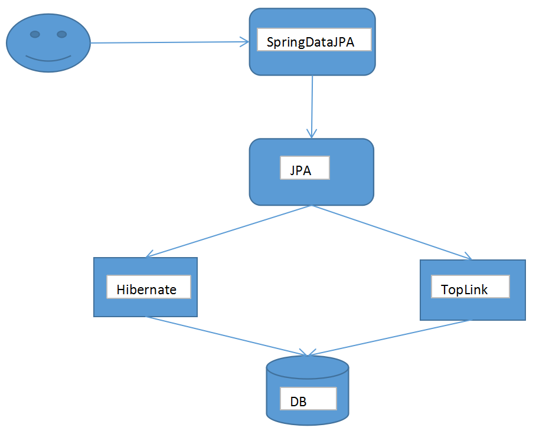
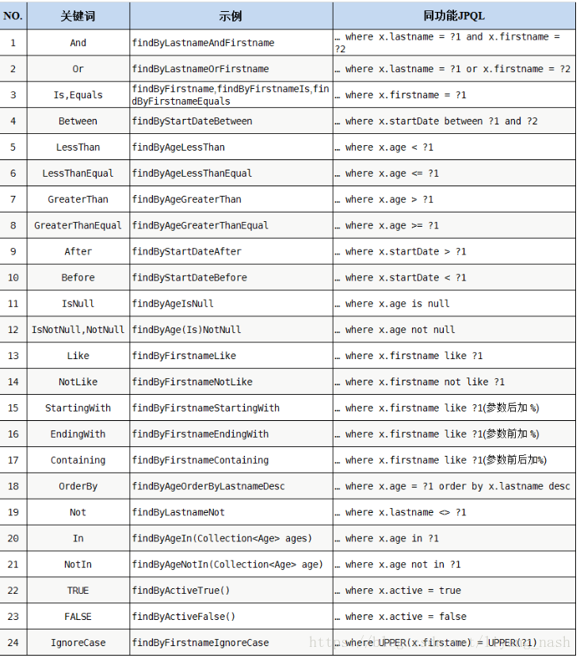

# 1.SpringDataJPA概述

SpringDataJPA是Spring针对JPA进行封装的框架,目的是<font style="color:red">简化</font>JPA针对DB持久层的操作.



# 2.SpringDataJPA入门操作

### 2.1引入依赖

```xml
<properties>
    <spring.version>5.0.2.RELEASE</spring.version>
    <hibernate.version>5.0.7.Final</hibernate.version>
    <slf4j.version>1.6.6</slf4j.version>
    <log4j.version>1.2.12</log4j.version>
    <c3p0.version>0.9.1.2</c3p0.version>
    <mysql.version>5.1.6</mysql.version>
</properties>

<dependencies>
    <!-- junit单元测试 -->
    <dependency>
        <groupId>junit</groupId>
        <artifactId>junit</artifactId>
        <version>4.12</version>
        <scope>test</scope>
    </dependency>

    <!-- spring beg -->
    <dependency>
        <groupId>org.aspectj</groupId>
        <artifactId>aspectjweaver</artifactId>
        <version>1.6.8</version>
    </dependency>

    <dependency>
        <groupId>org.springframework</groupId>
        <artifactId>spring-aop</artifactId>
        <version>${spring.version}</version>
    </dependency>

    <dependency>
        <groupId>org.springframework</groupId>
        <artifactId>spring-context</artifactId>
        <version>${spring.version}</version>
    </dependency>

    <dependency>
        <groupId>org.springframework</groupId>
        <artifactId>spring-context-support</artifactId>
        <version>${spring.version}</version>
    </dependency>

    <!-- spring对orm框架的支持包-->
    <dependency>
        <groupId>org.springframework</groupId>
        <artifactId>spring-orm</artifactId>
        <version>${spring.version}</version>
    </dependency>

    <dependency>
        <groupId>org.springframework</groupId>
        <artifactId>spring-beans</artifactId>
        <version>${spring.version}</version>
    </dependency>

    <dependency>
        <groupId>org.springframework</groupId>
        <artifactId>spring-core</artifactId>
        <version>${spring.version}</version>
    </dependency>

    <!-- spring end -->

    <!-- hibernate beg -->
    <dependency>
        <groupId>org.hibernate</groupId>
        <artifactId>hibernate-core</artifactId>
        <version>${hibernate.version}</version>
    </dependency>
    <dependency>
        <groupId>org.hibernate</groupId>
        <artifactId>hibernate-entitymanager</artifactId>
        <version>${hibernate.version}</version>
    </dependency>
    <dependency>
        <groupId>org.hibernate</groupId>
        <artifactId>hibernate-validator</artifactId>
        <version>5.2.1.Final</version>
    </dependency>
    <!-- hibernate end -->

    <!-- c3p0 beg -->
    <dependency>
        <groupId>c3p0</groupId>
        <artifactId>c3p0</artifactId>
        <version>${c3p0.version}</version>
    </dependency>
    <!-- c3p0 end -->

    <!-- log end -->
    <dependency>
        <groupId>log4j</groupId>
        <artifactId>log4j</artifactId>
        <version>${log4j.version}</version>
    </dependency>

    <dependency>
        <groupId>org.slf4j</groupId>
        <artifactId>slf4j-api</artifactId>
        <version>${slf4j.version}</version>
    </dependency>

    <dependency>
        <groupId>org.slf4j</groupId>
        <artifactId>slf4j-log4j12</artifactId>
        <version>${slf4j.version}</version>
    </dependency>
    <!-- log end -->


    <dependency>
        <groupId>mysql</groupId>
        <artifactId>mysql-connector-java</artifactId>
        <version>${mysql.version}</version>
    </dependency>

    <!-- spring data jpa 的坐标-->
    <dependency>
        <groupId>org.springframework.data</groupId>
        <artifactId>spring-data-jpa</artifactId>
        <version>1.9.0.RELEASE</version>
    </dependency>

    <dependency>
        <groupId>org.springframework</groupId>
        <artifactId>spring-test</artifactId>
        <version>${spring.version}</version>
    </dependency>

    <!-- el beg 使用spring data jpa 必须引入 -->
    <dependency>
        <groupId>javax.el</groupId>
        <artifactId>javax.el-api</artifactId>
        <version>2.2.4</version>
    </dependency>

    <dependency>
        <groupId>org.glassfish.web</groupId>
        <artifactId>javax.el</artifactId>
        <version>2.2.4</version>
    </dependency>
    <!-- el end -->
</dependencies>
```

### 2.2 编写配置文件

* applicationContext.xml

```xml
<!-- 1.创建entityManagerFactory对象交给spring容器管理-->
<bean id="entityManagerFactoty" class="org.springframework.orm.jpa.LocalContainerEntityManagerFactoryBean">
    <property name="dataSource" ref="dataSource" />
    <!--配置的扫描的包（实体类所在的包） -->
    <property name="packagesToScan" value="cn.itcast.domain" />
    <!-- jpa的实现厂家 -->
    <property name="persistenceProvider">
        <bean class="org.hibernate.jpa.HibernatePersistenceProvider"/>
    </property>

    <!--jpa的供应商适配器 -->
    <property name="jpaVendorAdapter">
        <bean class="org.springframework.orm.jpa.vendor.HibernateJpaVendorAdapter">
            <!--配置是否自动创建数据库表 -->
            <property name="generateDdl" value="true" />
            <!--指定数据库类型 -->
            <property name="database" value="MYSQL" />
            <!--数据库方言：支持的不同数据库sql特有语法 -->
            <property name="databasePlatform" value="org.hibernate.dialect.MySQLDialect" />
            <!--是否显示sql -->
            <property name="showSql" value="true" />
        </bean>
    </property>

    <!--jpa的方言 ：JPA实现厂商高级的特性 -->
    <property name="jpaDialect" >
        <bean class="org.springframework.orm.jpa.vendor.HibernateJpaDialect" />
    </property>
</bean>

<!--2.创建数据库连接池 -->
<bean id="dataSource" class="com.mchange.v2.c3p0.ComboPooledDataSource">
    <property name="user" value="root"></property>
    <property name="password" value="root"></property>
    <property name="jdbcUrl" value="jdbc:mysql:///jpa" ></property>
    <property name="driverClass" value="com.mysql.jdbc.Driver"></property>
</bean>

<!--3.整合spring dataJpa-->
<jpa:repositories base-package="cn.itcast.dao" entity-manager-factory-ref="entityManagerFactoty" />

<!--4.配置事务管理器 -->
<bean id="transactionManager" class="org.springframework.orm.jpa.JpaTransactionManager">
    <property name="entityManagerFactory" ref="entityManagerFactoty"></property>
</bean>

<!-- 5. 配置包扫描-->
<context:component-scan base-package="cn.itcast"/>
```

### 2.3 配置实体类映射关系

```java
@Entity
public class Customer {
    @Id
    @GeneratedValue(strategy = GenerationType.IDENTITY)
    private Long custId;
    private String custAddress;
    private String custIndustry;
    private String custLevel;
    private String custName;
    private String custPhone;
    private String custSource;
}
```

### 2.4 编写Dao接口

```java
/**
 * 接口1:JpaRepository<实体类型,主键类型>,封装了基本CRUD操作
 * 接口2:JpaSpecificationExecutor<实体类型>,封装了条件查询
 */
public interface CustomerDao extends JpaRepository<Customer,Long> ,JpaSpecificationExecutor<Customer>{
    
}
    
```

### 2.5 CURD基本操作

#### 2.5.1 增

```java
/**
 * save: 实体没有设置主键值,就执行保存
 */
@Test
public void testSave() {
    Customer customer  = new Customer();
    customer.setCustName("黑马程序员");
    customer.setCustLevel("vip");
    customer.setCustIndustry("it教育");
    customerDao.save(customer);
}
```

#### 2.5.2 删

```java
/**
 * 根据ID删除
 */
@Test
public void testDelete () {
    customerDao.delete(3L);
}
```

#### 2.5.3 改

```java
/**
 * save: 实体有主键值,就执行更新
 */
@Test
public void testUpdate() {
    Customer customer  = new Customer();
    customer.setCustId(1L);
    customer.setCustName("黑马程序员很厉害");
    customerDao.save(customer);
}
```

#### 2.5.4 查

##### 2.5.4.1 根据ID查询

```java
/**
 * 根据id查询,立即加载
 */
@Test
public void testFindOne() {
    Customer customer = customerDao.findOne(1L);
    System.out.println(customer);
}

/**
 * 根据id查询,懒加载
 */
@Test
@Transactional		//保证在test方法中查询数据库时,Session没有被关闭
public void  testGetOne() {
    Customer customer = customerDao.getOne(8L);
    System.out.println(customer);
}
```

##### 2.5.4.2 查询所有

```java
/**
 * 查询所有
 */
@Test
public void testFindAll() {
    List<Customer> list = customerDao.findAll();
    for(Customer customer : list) {
        System.out.println(customer);
    }
}
```

##### 2.5.4.3 判断某条数据是否存在

```java
/**
 * 判断id为XXX的数据是否存在
 */
@Test
public void  testExists() {
    boolean exists = customerDao.exists(4l);
    System.out.println("id为4的客户 是否存在："+exists);
}
```

##### 2.5.4.4 统计查询

```java
/**
 * 统计数据总条数
 */
@Test
public void testCount() {
    long count = customerDao.count();
    System.out.println(count);
}
```

# 3.SpringDataJPA原理分析

1. 在调用接口的CURD方法时,SpringDataJPA会使用JDK动态代理生成接口的代理对象
2. 代理对象的类型是```SimpleJpaRepository```
3. 接口的方法在```SimpleJpaRepository```类中进行了默认实现

# 4.SpringDataJPA复杂查询

### 4.1 JPQL查询

#### 4.1.1 单条件

```java
/**
 * 根据客户名称查询客户
 */
@Query(value="from Customer where custName = ?")
public Customer findJpql(String custName);
```

#### 4.1.2 多个条件

```java
/**
 * 根据客户名称和客户id查询客户
 * 通过索引指定匹配的参数值
 */
@Query(value = "from Customer where custName = ?2 and custId = ?1")
public Customer findCustNameAndId(Long id,String name);
```

#### 4.1.3 更新数据

```java
/**
 * 使用jpql完成更新操作
 * 注意要添加Modifying注解
 */
@Query(value = " update Customer set custName = ?2 where custId = ?1 ")
@Modifying
public void updateCustomer(long custId,String custName);

/***************************************************************/

/**
 * 测试jpql的更新操作
 */
@Test
@Transactional //添加事务的支持
@Rollback(value = false)	////测试方法会在执行完毕后,默认回滚事务
public void testUpdateCustomer() {
    customerDao.updateCustomer(8L,"黑马程序员");
}
```

### 4.2 SQL查询

```java
/**
 * 使用sql的形式查询
 */
@Query(value="select * from cst_customer where cust_name like ?1",nativeQuery = true)
public List<Object [] > findSql(String name);
```

### 4.3 方法命名查询



#### 4.3.1 单条件完全匹配

```java
/**
 * 方法命名规则查询
 * 同功能JPQL:from Customer where custName=?
 */
public Customer findByCustName(String custName);
```

#### 4.3.2 单条件模糊查询

```java
/**
 * 方法命名规则查询
 * 同功能JPQL:from Customer where custName like ?
 */
public List<Customer> findByCustNameLike(String custName);
```

#### 4.3.4 多条件组合查询

```java
/**
 * 方法命名规则查询
 * 同功能JPQL:from Customer where custName like ? and  custIndustry = ?
 */
public Customer findByCustNameLikeAndCustIndustry(String custName,String custIndustry);
```

[案例源码](https://github.com/fudingcheng/JPA-Demo)