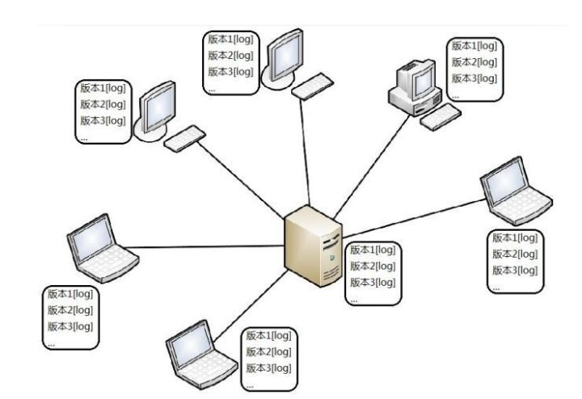
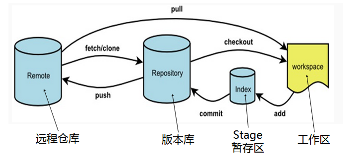

# 1. 版本控制

## 1.1 作用

1. 版本控制可以记录每次数据的变更
2. 还能够帮助还原任何一次的历史变更
3. 实现团队的协同工作

## 1.2 分类 

1. 集中式版本控制--svn


1. 分布式版本控制--git



# 2. Git

分布式的版本管理git由Linus(Linux开发者)开发

## 2.1 诞生过程

* 2005 年 4 月 3 日， 开始开发 Git。 
* 2005 年 4 月 6 日， 项目发布。 
* 2005 年 4 月 7 日， Git就可以作为自身的版本 控制 工具 了。 
* 2005 年 4 月 18 日， 发生 第一个多分支合并。 
* 2005 年 4 月 29 日， Git的性能就已经达到 了 Linus 的 预期。

## 2.2 与SVN的区别

* 强容灾性
* 速度快
* 设计简单
* 很好的分支管理
* 大型项目的版本控制大多基于git管理

### 2.3 git工作流程

1. 从远程仓库中clone资源到本地仓库。
2. 从本地仓库checkout代码进行修改
3. 将修改后代码add到暂存区
4. commit修改到本地仓库
5. push本地仓库修改到远程仓库



# 3. 安装与安装

## 3.1 git

[下载地址](https://git-scm.com/download),windows版双击默认安装即可

## 3.2 TortoiseGit

git图形化客户端

[下载地址](https://tortoisegit.org/)

# 4. Git基本操作

```shell
# 1.创建仓库
git init
# 2.添加文件到暂存区 . 或者文件名
git add .
# 3.提交文件到master分支
git commit . -m '提交日志'
```

> 工作区:电脑里能看到的目录
>
> 版本库:工作区有一个隐藏目录`.git`
>
> 暂存区:版本库中有一个叫做stage（或者叫index）


# 5. 远程仓库

# 6. 分支管理

# 7. IDEA中使用Git