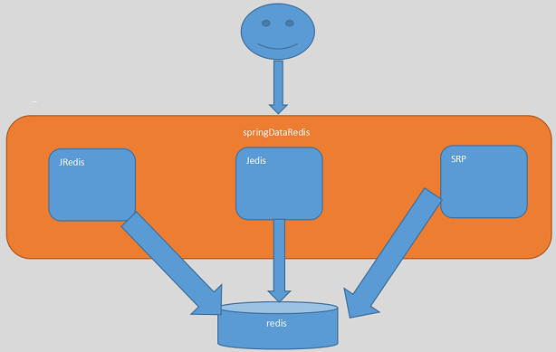

# 1. 品优购前台分析

## 1.1 广告模块表结构

广告和广告分类表是一对多的关系

### 1.1.1 广告分类表

tb_content_category

| Field | Type                | Comment |
| ----- | ------------------- | ------- |
| id    | bigint(20) NOT NULL | 类目ID    |
| name  | varchar(50) NULL    | 分类名称    |

### 1.1.2 广告内容表

tb_content

| Field       | Type                | Comment |
| ----------- | ------------------- | ------- |
| id          | bigint(20) NOT NULL |         |
| category_id | bigint(20) NOT NULL | 内容类目ID  |
| title       | varchar(200) NULL   | 内容标题    |
| url         | varchar(500) NULL   | 链接      |
| pic         | varchar(300) NULL   | 图片绝对路径  |
| status      | varchar(1) NULL     | 状态      |
| sort_order  | int(11) NULL        | 排序      |

# 2. 广告模块管理

## 2.1 基本CURD

* 创建广告模块接口工程	pinyougou-content-interface
* 创建广告模块服务工程 pinyougou-content-service
* 在运营商后台系统引入广告接口依赖
* 拷贝广告模块相关代码完成基本CURD功能

## 2.2 广告图片上传

* 页面

```html
<tr>             
     <td>图片</td>
     <td>
     	<input type="file" id="file">
     	<button ng-click="uploadFile()">上传</button>
     	
     </td>
</tr>
```

* contentController.js

```javascript
$scope.uploadFile=function(){
	uploadService.uploadFile().success(
		function(response){
			if(response.success){
				$scope.entity.pic= response.message;
			}else{
				alert(response.message);					
			}
		}		
	).error(
		function(){
			alert("上传出错");
		}	
	);	
}
```

* UploadController.java

```java
@Value("${FILE_SERVER_URL}")
private String file_server_url;

@RequestMapping("/upload")
public Result upload(MultipartFile file){
	
	String originalFilename = file.getOriginalFilename();//获取文件名
	String extName=originalFilename.substring( originalFilename.lastIndexOf(".")+1);//得到扩展名
	
	try {
		util.FastDFSClient client=new FastDFSClient("classpath:config/fdfs_client.conf");
		String fileId = client.uploadFile(file.getBytes(), extName);
		String url=file_server_url+fileId;//图片完整地址
		return new Result(true, url);
		
	} catch (Exception e) {
		e.printStackTrace();
		return new Result(false, "上传失败");
	}
	
}
```

* Spring配置文件

```xml
<bean id="multipartResolver"
	class="org.springframework.web.multipart.commons.CommonsMultipartResolver">
	<property name="defaultEncoding" value="UTF-8"></property>
	<!-- 设定文件上传的最大值 5MB，5*1024*1024 -->
	<property name="maxUploadSize" value="5242880"></property>
</bean>
```

## 2.3 广告分类下拉框

* 页面

```html
<body ng-app="pinyougou" ng-controller="contentController" ng-init="findContentCategoryList()">
    
    ...
    <select  ng-model="entity.categoryId" 
             ng-options="item.id as item.name for item in contentCategoryList" >
    </select>
</body>
```

* contentController.js

```javascript
$scope.findContentCategoryList=function(){
	contentCategoryService.findAll().success(
		function(response){
			$scope.contentCategoryList=response;
		}
	);
}
```

* ContentCategoryController

```java
@RequestMapping("/findAll")
public List<TbContentCategory> findAll(){			
	return contentCategoryService.findAll();
}
```

* ContentCategoryServiceImpl

```java
public List<TbContentCategory> findAll() {
	return contentCategoryMapper.selectByExample(null);
}
```

## 2.4 广告状态选择

* contentController.js中定义状态数组

```javascript
$scope.status=["无效","有效"];
```

* 页面

```html
<!--选择-->
<input  type="checkbox"  ng-model="entity.status"  ng-true-value="1" ng-false-value="0">

<!--显示-->
<tr ng-repeat="entity in list">
	...
    {{status[entity.status]}}
</tr>
```

# 3. 前台广告轮播显示

## 3.1 广告轮播显示

* 创建前台Web工程 pinyougou-portal-web

  pinyougou-portal-web：负责首页的显示

  前台系统特点：面向互联网用户，访问量大，不同的功能页面使用不同服务器运行.

## 3.2 编码实现

* 页面

```html
<body ng-app="pinyougou" ng-controller="contentController" ng-init="findByCategoryId(1);">
    <!--圆点-->
    <ol>
        <li data-slide-to="{{$index}}" 
            class="{{$index==0?'active':''}}" 
            ng-repeat="item in contentList[1]">
        </li>					    
    </ol>

    <!--图片-->
    <div id="myCarousel">
        <div class="{{$index==0?'active':''}} item" ng-repeat="item in contentList[1]">
            <a href="{{item.url}}">
                
            </a>
        </div>					    
    </div>
    <!--左右选择-->
    <a href="#myCarousel" data-slide="prev" class="carousel-control left">‹</a>
    <a href="#myCarousel" data-slide="next" class="carousel-control right">›</a>
</body>
```

* contentController.js

```javascript
$scope.contentList=[];
$scope.findByCategoryId=function(categoryId){
	contentService.findByCategoryId(categoryId).success(
		function(response){
			$scope.contentList[categoryId]=response;
		}
	);		
}
```

* ContentController

```java
@RequestMapping("/findByCategoryId")
public List<TbContent> findByCategoryId(Long categoryId) {
	return contentService.findByCategoryId(categoryId);
}
```

* ContentServiceImpl

```java
public List<TbContent> findByCategoryId(Long categoryId) {
    TbContentExample contentExample=new TbContentExample();
    Criteria criteria = contentExample.createCriteria();
    criteria.andCategoryIdEqualTo(categoryId);
    criteria.andStatusEqualTo("1");//开启状态
    contentExample.setOrderByClause("sort_order");//排序 
    return contentMapper.selectByExample(contentExample);
}
```

# 4. SpringDataRedis

## 4.1 概念介绍

**Redis:**是一个no-sql数据库.典型的key-value;

**Jedis:**操作Redis的Java客户端;其他还有JRedis,SRP客户端和Jedis的作用类似.

**SpringDataRedis:**针对常见的Redis客户端进行了封装,简化操作.



## 4.2 数据结构

```
String:字符串;
List:双向链表
Set:集合;值不会重复,无序.
ZSet:集合;元素有序;
Hash:哈希;
```

## 4.3 ops对象

```
BoundValueOperations
BoundListOperations
BoundSetOperations
BoundZSetOperations
BoundHashOperations		
```

## 4.4 常用操作

### 4.4.1 环境准备

* pom.xml

```xml
<!-- 集中定义依赖版本号 -->
<properties>
    <spring.version>4.2.4.RELEASE</spring.version>
</properties>

<dependencies>
    <!-- Spring -->
    <dependency>
        <groupId>org.springframework</groupId>
        <artifactId>spring-context</artifactId>
        <version>${spring.version}</version>
    </dependency>
    <dependency>
        <groupId>org.springframework</groupId>
        <artifactId>spring-beans</artifactId>
        <version>${spring.version}</version>
    </dependency>
    <dependency>
        <groupId>org.springframework</groupId>
        <artifactId>spring-webmvc</artifactId>
        <version>${spring.version}</version>
    </dependency>
    <dependency>
        <groupId>org.springframework</groupId>
        <artifactId>spring-jdbc</artifactId>
        <version>${spring.version}</version>
    </dependency>
    <dependency>
        <groupId>org.springframework</groupId>
        <artifactId>spring-aspects</artifactId>
        <version>${spring.version}</version>
    </dependency>
    <dependency>
        <groupId>org.springframework</groupId>
        <artifactId>spring-jms</artifactId>
        <version>${spring.version}</version>
    </dependency>
    <dependency>
        <groupId>org.springframework</groupId>
        <artifactId>spring-context-support</artifactId>
        <version>${spring.version}</version>
    </dependency>
    <dependency>
        <groupId>org.springframework</groupId>
        <artifactId>spring-test</artifactId>
        <version>${spring.version}</version>
    </dependency>
    <dependency>
        <groupId>junit</groupId>
        <artifactId>junit</artifactId>
        <version>4.9</version>
    </dependency>
    <!-- 缓存 -->
    <dependency>
        <groupId>redis.clients</groupId>
        <artifactId>jedis</artifactId>
        <version>2.8.1</version>
    </dependency>
    <dependency>
        <groupId>org.springframework.data</groupId>
        <artifactId>spring-data-redis</artifactId>
        <version>1.7.2.RELEASE</version>
    </dependency>
    <dependency>
        <groupId>org.slf4j</groupId>
        <artifactId>slf4j-nop</artifactId>
        <version>1.7.2</version>
    </dependency>
</dependencies>
```

* Spring配置文件

```xml
<bean id="poolConfig" class="redis.clients.jedis.JedisPoolConfig">  
  <property name="maxIdle" value="${redis.maxIdle}" />   
  <property name="maxWaitMillis" value="${redis.maxWait}" />  
  <property name="testOnBorrow" value="${redis.testOnBorrow}" />  
</bean>  

<bean id="JedisConnectionFactory"
      class="org.springframework.data.redis.connection.jedis.JedisConnectionFactory" 
      p:host-name="${redis.host}" 
      p:port="${redis.port}" 
      p:password="${redis.pass}" 
      p:pool-config-ref="poolConfig"/>

<bean id="redisTemplate" class="org.springframework.data.redis.core.RedisTemplate">
 	<property name="connectionFactory" ref="JedisConnectionFactory" />  
</bean>  
```

```properties
redis.host=127.0.0.1
redis.port=6379
redis.pass=
redis.database=0
redis.maxIdle=300
redis.maxWait=3000
redis.testOnBorrow=true
```

### 4.4.2 字符串操作

```java
//添加元素
redisTemplate.boundValueOps("name").set("itcast");

//查询元素
String str = (String) redisTemplate.boundValueOps("name").get();

//删除元素
redisTemplate.delete("name");
```

### 4.4.3 List操作

```java
//添加元素-左压栈
redisTemplate.boundListOps("namelist2").leftPush("刘备");
redisTemplate.boundListOps("namelist2").leftPush("关羽");
redisTemplate.boundListOps("namelist2").leftPush("张飞");

//添加元素-右压栈
redisTemplate.boundListOps("namelist1").rightPush("刘备");
redisTemplate.boundListOps("namelist1").rightPush("关羽");
redisTemplate.boundListOps("namelist1").rightPush("张飞");

//查询元素,在指定范围查找元素; 参数一:开始索引位置,从0开始;	参数2:结束索引
redisTemplate.boundListOps("namelist1").range(0, 10);

//删除所有元素
redisTemplate.delete("namelist1");

//删除某个元素 参数一:元素个数; 参数二:元素值
redisTemplate.boundListOps("namelist1").remove(1, "刘备");
```

### 4.4.4 Set操作

```java
//添加元素
redisTemplate.boundSetOps("nameset").add("曹操");
redisTemplate.boundSetOps("nameset").add("刘备");
redisTemplate.boundSetOps("nameset").add("孙权");

//查询元素,查找所有元素
Set set = redisTemplate.boundSetOps("nameset").members();

//查找元素,随机返回某个元素
String value = (String) redisTemplate.boundSetOps("nameset").randomMember();

//删除某个元素
redisTemplate.boundSetOps("nameset").remove("孙权");

//删除所有元素
redisTemplate.delete("nameset");
```

### 4.4.5 ZSet操作

```java
//添加元素
redisTemplate.boundZSetOps("namezset").add("zs",1);
redisTemplate.boundZSetOps("namezset").add("ls",2);
redisTemplate.boundZSetOps("namezset").add("ww",3);

//查询元素
Set set = redisTemplate.boundZSetOps("namezset").range(0, 10);

//删除某个元素; 参数一:开始索引位置,从0开始;	参数2:结束索引
redisTemplate.boundZSetOps("namezset").removeRange(0,10);

//删除所有元素
redisTemplate.delete("namezset");
```

### 4.4.6 Hash操作

```java
//添加元素
redisTemplate.boundHashOps("namehash").put("a", "唐僧");
redisTemplate.boundHashOps("namehash").put("b", "悟空");
redisTemplate.boundHashOps("namehash").put("c", "八戒");
redisTemplate.boundHashOps("namehash").put("d", "沙僧");

//查询所有key
Set keys = redisTemplate.boundHashOps("namehash").keys();

//查询所有value
List list = redisTemplate.boundHashOps("namehash").values();

//根据key获得某个value
String str = (String) redisTemplate.boundHashOps("namehash").get("b");

//根据key删除
redisTemplate.boundHashOps("namehash").delete("c");

//删除所有元素
redisTemplate.boundHashOps("namehash").delete();
```

# 5. 广告内容缓存

## 5.1 查询广告时缓存

```java
public List<TbContent> findByCategoryId(Long categoryId) {
	
	List<TbContent> list = (List<TbContent>) redisTemplate.boundHashOps("content").get(categoryId);
   	
	if(list==null){
		System.out.println("从数据库中查询数据并放入缓存 ");
		TbContentExample example=new TbContentExample();
		Criteria criteria = example.createCriteria();
		criteria.andCategoryIdEqualTo(categoryId);//指定条件:分类ID
		criteria.andStatusEqualTo("1");//指定条件：有效
		example.setOrderByClause("sort_order");//排序			
		list = contentMapper.selectByExample(example);
		redisTemplate.boundHashOps("content").put(categoryId, list);//放入缓存
	}else{
		System.out.println("从缓存中查询数据 ");
	}
			
	return list;
}
```

## 5.2 缓存失效处理

* 增

```java
public void add(TbContent content) {
	contentMapper.insert(content);
	//清除缓存
	redisTemplate.boundHashOps("content").delete(content.getCategoryId());
}
```

* 删

```java
public void delete(Long[] ids) {
	for(Long id:ids){
		//清除缓存
		Long categoryId = contentMapper.selectByPrimaryKey(id).getCategoryId();			
		redisTemplate.boundHashOps("content").delete(categoryId);
		
		contentMapper.deleteByPrimaryKey(id);
	}		
}
```

* 改

```java
public void update(TbContent content){
	//查询原来的分组ID
	Long categoryId = contentMapper.selectByPrimaryKey(content.getId()).getCategoryId();
	//清除原分组的缓存
	redisTemplate.boundHashOps("content").delete(categoryId);
	
	contentMapper.updateByPrimaryKey(content);
	//清除现分组缓存
	if(categoryId.longValue()!=content.getCategoryId().longValue()){
		redisTemplate.boundHashOps("content").delete(content.getCategoryId());
	}
}
```

