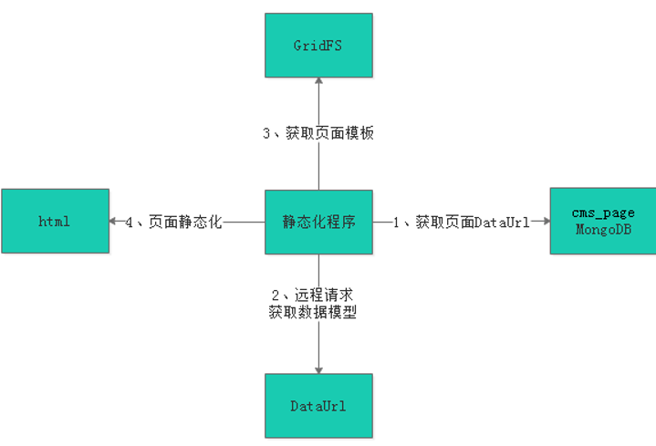
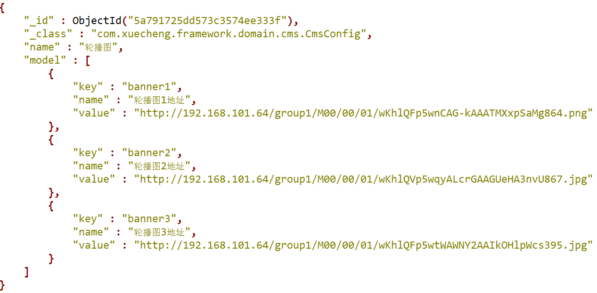
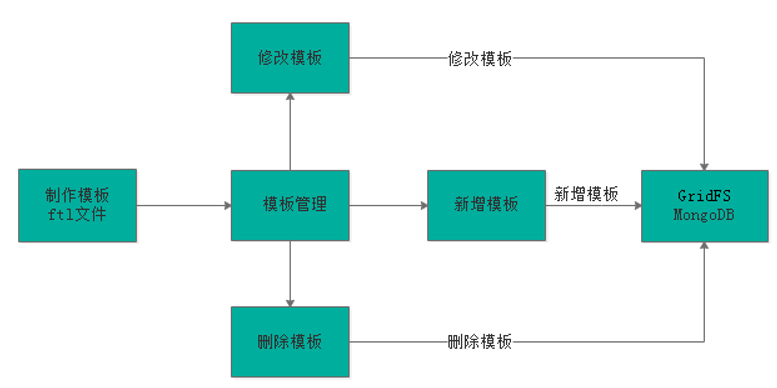
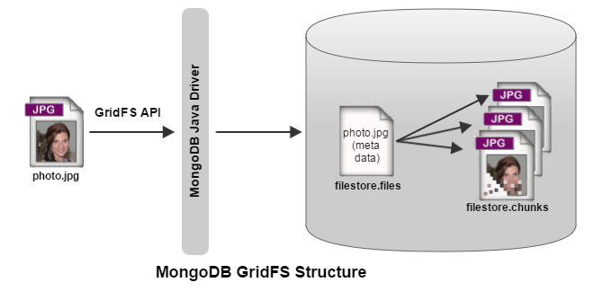
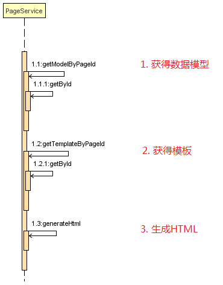
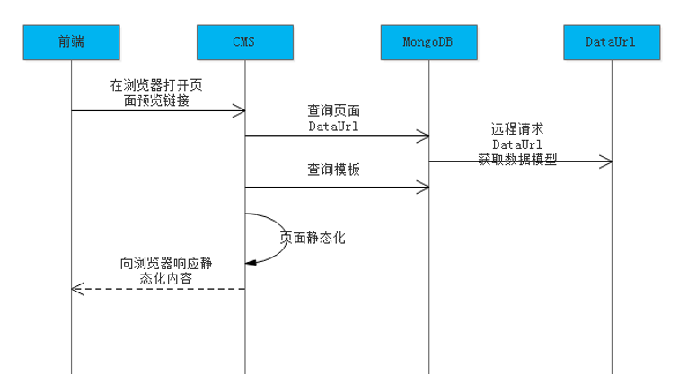

# 1. 静态化需求

1. **为什么进行页面管理?**

   本项目cms系统的功能就是根据运营需要，对门户等子系统的部分页面进行管理，从而实现快速根据用户需求修改页面内容并上线的需求。

2. **如何修改页面内容?**

   在开发中修改页面内容是需要人工编写html及JS文件，CMS系统是通过程序自动化的对页面内容进行修改，通过页面静态化技术生成html页面。

3. **如何进行页面静态化?**

   一个页面等于模板加数据，在添加页面的时候我们选择了页面的模板。

4. **页面静态化流程?**


业务流程执行如下:

1. 获取模型数据
2. 制作模板
3. 对页面进行静态化
4. 将静态化生成的html页面存放文件系统中
5. 将存放在文件系统的html文件发布到服务器

# 2. FreeMarker

## 2.1 概述

**FreeMarker**是一个基于[Java](https://zh.wikipedia.org/wiki/Java)的[模板引擎](https://zh.wikipedia.org/wiki/%E6%A8%A1%E6%9D%BF%E5%BC%95%E6%93%8E)，最初专注于使用[MVC](https://zh.wikipedia.org/wiki/Model-view-controller)[软件架构](https://zh.wikipedia.org/wiki/%E8%BD%AF%E4%BB%B6%E6%9E%B6%E6%9E%84)生成动态网页。但是，它是一个通用的模板引擎，不依赖于[servlet](https://zh.wikipedia.org/wiki/Servlet)s或[HTTP](https://zh.wikipedia.org/wiki/HTTP)或[HTML](https://zh.wikipedia.org/wiki/HTML)，因此它通常用于生成源代码，配置文件或电子邮件。


常用的java模板引擎还有哪些？

Jsp、Freemarker、Thymeleaf 、Velocity 等。

## 2.2 操作流程

### 2.2.1 定义模板

```html
<html>
<head>
  <title>Welcome!</title>
</head>
<body>
  <h1>Welcome ${user}!</h1>
  <p>Our latest product:
  <a href="${latestProduct.url}">${latestProduct.name}</a>!
</body>
</html>
```

### 2.2.2 定义数据

```json
(root)
  |
  +- user = "Big Joe"
  |
  +- latestProduct
      |
      +- url = "products/greenmouse.html"
      |
      +- name = "green mouse"
```

### 2.2.3 输出HTML

```html
<html>
<head>
  <title>Welcome!</title>
</head>
<body>
  <h1>Welcome John Doe!</h1>
  <p>Our latest product:
  <a href="products/greenmouse.html">green mouse</a>!
</body>
</html>
```

## 2.3 快速入门

freemarker作为springmvc一种视图格式，默认情况下SpringMVC支持freemarker视图格式。

### 2.3.1 创建工程

创建```SpringBoot```工程,集成```FreeMarker```启动器

pom.xml

```xml
<parent>
    <artifactId>xc-framework-parent</artifactId>
    <groupId>com.xuecheng</groupId>
    <version>1.0-SNAPSHOT</version>
    <relativePath>../xc-framework-parent/pom.xml</relativePath>
</parent>
<modelVersion>4.0.0</modelVersion>

<artifactId>test-freemarker</artifactId>
<dependencies>
    <dependency>
        <groupId>org.springframework.boot</groupId>
        <artifactId>spring-boot-starter-freemarker</artifactId>
    </dependency>
    <dependency>
        <groupId>org.springframework.boot</groupId>
        <artifactId>spring-boot-starter-web</artifactId>
    </dependency>
    <dependency>
        <groupId>org.projectlombok</groupId>
        <artifactId>lombok</artifactId>
    </dependency>
    <dependency>
        <groupId>com.squareup.okhttp3</groupId>
        <artifactId>okhttp</artifactId>
    </dependency>
    <dependency>
        <groupId>org.springframework.boot</groupId>
        <artifactId>spring-boot-starter-test</artifactId>
    </dependency>
    <dependency>
        <groupId>org.apache.commons</groupId>
        <artifactId>commons-io</artifactId>
    </dependency>
</dependencies>
```

### 2.3.2 配置文件

application.yml:配置参数

```yaml
server:
  port: 8088 #服务端口
spring:
 application:
    name: test‐freemarker #指定服务名
 freemarker:
   cache: false  #关闭模板缓存，方便测试
   settings:
     template_update_delay: 0 #检查模板更新延迟时间，设置为0表示立即检查，如果时间大于0会有缓存不方便进行模板测试
```

logback-spring.xml:日志文件

### 2.3.3 模型类

```java
@Data
@ToString
public class Student {
    private String name;//姓名
    private int age;//年龄
    private Date birthday;//生日
    private Float money;//钱包
    private List<Student> friends;//朋友列表
    private Student bestFriend;//最好的朋友
}
```

### 2.3.4 创建模板

位置:templates/test1.ftl

```java
<!DOCTYPE html>
<html>
<head>
    <meta charset="utf‐8">
    <title>Hello World!</title>
</head>
<body>
Hello ${name}!
</body>
</html>
```

### 2.3.4 创建Controller

```java
@RequestMapping("/freemarker")
@Controller
public class FreemarkerController {

    @RequestMapping("/test1")
    public String freemarker(Map<String, Object> map){
        map.put("name","黑马程序员");
        //返回模板文件名称
        return "test1";
    }
}
```

### 2.3.5 启动类

```java
@SpringBootApplication
public class FreemarkerTestApplication {
    public static void main(String[] args) {
        SpringApplication.run(FreemarkerTestApplication.class,args);
    }
}
```

## 2.4 基础语法

1. 注释，即<#‐‐和‐‐>，介于其之间的内容会被```freemarker```忽略
2. 插值（Interpolation）：即```${..}```部分,```freemarker```会用真实的值代替${..}
3. FTL指令：和`HTML`标记类似，名字前加#予以区分，`Freemarker`会解析标签中的表达式或逻辑。
4. 文本，仅文本信息，这些不是freemarker的注释、插值、FTL指令的内容会被freemarker忽略解析，直接输出内容

### 2.4.1 指令

#### 2.4.1.1 List指令

```java
map.put("stus",stus);
```

```html
<#list stus as stu>
    <tr>
        <td>${stu_index + 1}</td>
        <td>${stu.name}</td>
        <td>${stu.age}</td>
        <td>${stu.mondy}</td>
    </tr>
</#list>
```

#### 2.4.1.2 if指令

```java
<#list stus as stu>
    <tr>
        <td <#if stu.name =='小明'>style="background:red;"</#if>>${stu.name}</td>
        <td>${stu.age}</td>
        <td >${stu.mondy}</td>
    </tr>
</#list>
```

#### 2.4.1.3 空值判断

1. 判断stus是否为空

```html
<#if stus??>
    <#list stus as stu>
     ......    
    </#list>
</#if>
```

2. 值为空时,输出默认值

```html
${(stu.bestFriend.name)!''}
```

### 2.4.2 内建函数

#### 2.4.2.1 集合大小

```html
${集合名?size}
```

#### 2.4.2.2 日期格式化

```html
显示年月日: ${today?date}
显示时分秒：${today?time}  
显示日期+时间：${today?datetime} <br>       
自定义格式化：  ${today?string("yyyy年MM月")}
```

#### 2.4.2.3 格式化数字

```java
map.put("point", 102920122);
```

```html
${point?c}
```

## 2.4 静态化测试

### 2.4.1 基于模板测试

```java
public void testGenerateHtml() throws IOException, TemplateException {
    //创建配置类
    Configuration configuration=new Configuration(Configuration.getVersion());
    String classpath = this.getClass().getClassLoader().getResource("\\").getPath();
    //设置模板路径
    configuration.setDirectoryForTemplateLoading(new File(classpath + "/templates/"));
    //设置字符集
    configuration.setDefaultEncoding("utf-8");
    //加载模板
    Template template = configuration.getTemplate("test1.ftl");
    //数据模型
    Map map = getMap();
    //静态化
    String content = FreeMarkerTemplateUtils.processTemplateIntoString(template, map);
    //静态化内容
    System.out.println(content);
    InputStream inputStream = IOUtils.toInputStream(content);
    //输出文件
    FileOutputStream fileOutputStream = new FileOutputStream(new File("XXXX\\test1.html"));
    int copy = IOUtils.copy(inputStream, fileOutputStream);
}
```

### 2.4.2 基于模板字符串

```java
public void testGenerateHtmlByString() throws IOException, TemplateException {
    //创建配置类
    Configuration configuration=new Configuration(Configuration.getVersion());
    //获取模板内容
    //模板内容，这里测试时使用简单的字符串作为模板
    String templateString="" +
            "<html>\n" +
            "    <head></head>\n" +
            "    <body>\n" +
            "    名称：${name}\n" +
            "    </body>\n" +
            "</html>";

    //加载模板
    //模板加载器
    StringTemplateLoader stringTemplateLoader = new StringTemplateLoader();
    stringTemplateLoader.putTemplate("template",templateString);
    configuration.setTemplateLoader(stringTemplateLoader);
    Template template = configuration.getTemplate("template","utf-8");

    //数据模型
    Map map = getMap();
    //静态化
    String content = FreeMarkerTemplateUtils.processTemplateIntoString(template, map);
    //静态化内容
    System.out.println(content);
    InputStream inputStream = IOUtils.toInputStream(content);
    //输出文件
    FileOutputStream fileOutputStream = new FileOutputStream(new File("d:/test1.html"));
    IOUtils.copy(inputStream, fileOutputStream);
}
```

# 3. 页面静态化

## 3.1 流程分析

页面静态化的条件:模板+数据模型=输出

1. 模板:由前端人员/美工提供
2. 数据模型:由后台开发具体模块的工程师提供DataUrl获取数据模型

页面静态化流程:

1. 静态化程序首先读取页面获取DataUrl。
2. 静态化程序远程请求DataUrl得到数据模型。
3. 获取页面模板。
4. 执行页面静态化。



## 3.2 数据模型

数据模型集合为cms_config,根据_id查询对应的模型数据



### 3.2.1 轮播图DataUrl接口

#### 3.2.1.1 接口定义

* cms_config对应基础实体

```java
@Data
@ToString
@Document(collection = "cms_config")
public class CmsConfig {
    @Id
    private String id;//主键
    private String name;//数据模型的名称
    private List<CmsConfigModel> model;//数据模型项目
}
```
数据模型
```java
@Data
@ToString
public class CmsConfigModel {
    private String key;//主键
    private String name;//项目名称
    private String url;//项目url
    private Map mapValue;//项目复杂值
    private String value;//项目简单值
}
```

* 接口定义

```java
@Api(value="cms配置管理接口",description = "cms配置管理接口，提供数据模型的管理、查询接口")
public interface CmsConfigControllerApi {
    @ApiOperation("根据id查询CMS配置信息")
    public CmsConfig getmodel(String id);
}
```

#### 3.2.1.2 Dao

```java
public interface CmsConfigRepository extends MongoRepository<CmsConfig,String> {
}
```

#### 3.2.1.3 Service

```java
@Service
public class CmsConfigService {
    @Autowired
    CmsConfigRepository cmsConfigRepository;
    //根据id查询配置管理信息
    public CmsConfig getConfigById(String id){
        Optional<CmsConfig> optional = cmsConfigRepository.findById(id);
        if(optional.isPresent()){
            CmsConfig cmsConfig = optional.get();
            return cmsConfig;
        }
        return null;
    }
}
```

#### 3.2.1.4 Controller

```java
@RestController
@RequestMapping("/cms/config")
public class CmsConfigController implements CmsConfigControllerApi {
    @Autowired
    CmsConfigService cmsConfigService;
    @Override
    @GetMapping("/getmodel/{id}")
    public CmsConfig getmodel(@PathVariable("id") String id) {
        return cmsConfigService.getConfigById(id);
    }
}
```

#### 3.2.1.5 测试

get请求：http://localhost:31001/cms/config/getmodel/5a791725dd573c3574ee333f  （轮播图信息）

### 3.2.3 远程请求接口

CMS系统通过SpringMVC提供的RestTemplate请求http接口,RestTemplate的底层可以使用第三方的http客户端工具实现http 的请求，常用的http客户端工具有Apache HttpClient、OkHttpClient等，本项目使用OkHttpClient完成http请求，原因也是因为它的性能比较出众。

#### 3.2.3.1 添加依赖

```xml
<dependency>
    <groupId>com.squareup.okhttp3</groupId>
    <artifactId>okhttp</artifactId>
</dependency>
```

#### 3.2.3.2 配置RestTemplate

在SpringBoot启动类中配置 RestTemplate

```java
@SpringBootApplication
...
public class ManageCmsApplication {
    public static void main(String[] args) {
        SpringApplication.run(ManageCmsApplication.class,args);
    }
    @Bean
    public RestTemplate restTemplate() {
        return new RestTemplate(new OkHttp3ClientHttpRequestFactory());
    }
}
```

#### 3.2.3.4 测试RestTemplate

```java
@Test
public void testRestTemplate(){
    ResponseEntity<Map> forEntity =restTemplate.getForEntity(
        				"http://localhost:31001/cms/config/get/5a791725dd573c3574ee333f",Map.class);
    System.out.println(forEntity);
}
```

## 3.3 模板管理

### 3.3.1 流程分析

1. 参考页面原型制作模板
2. 完成模板管理的CURD
3. 模板信息存在在MongoDB的cms_template中,模板文件存储在GridFS文件系统中




### 3.3.2 模板制作

#### 3.3.2.1 编写模板文件

1. 页面原型

```html
 <!DOCTYPE html>
<html lang="en">
<head>
    <meta charset="UTF‐8">
    <title>Title</title>
    <link rel="stylesheet" href="http://www.xuecheng.com/plugins/normalize‐css/normalize.css" />
    <link rel="stylesheet"
href="http://www.xuecheng.com/plugins/bootstrap/dist/css/bootstrap.css" />
    <link rel="stylesheet" href="http://www.xuecheng.com/css/page‐learing‐index.css" />
    <link rel="stylesheet" href="http://www.xuecheng.com/css/page‐header.css" />
</head>
<body>
<div class="banner‐roll">
    <div class="banner‐item">
        <div class="item" style="background‐image: url(../img/widget‐bannerB.jpg);"></div>
        <div class="item" style="background‐image: url(../img/widget‐bannerA.jpg);"></div>
        <div class="item" style="background‐image: url(../img/widget‐banner3.png);"></div>
        <div class="item" style="background‐image: url(../img/widget‐bannerB.jpg);"></div>
        <div class="item" style="background‐image: url(../img/widget‐bannerA.jpg);"></div>
        <div class="item" style="background‐image: url(../img/widget‐banner3.png);"></div>
    </div>
    <div class="indicators"></div>
</div>
<script type="text/javascript" src="http://www.xuecheng.com/plugins/jquery/dist/jquery.js">
</script>
<script type="text/javascript"
src="http://www.xuecheng.com/plugins/bootstrap/dist/js/bootstrap.js"></script>
<script type="text/javascript">
    var tg = $('.banner‐item .item');
    var num = 0;
    for (i = 0; i < tg.length; i++) {
        $('.indicators').append('<span></span>');
        $('.indicators').find('span').eq(num).addClass('active');
    }
    function roll() {
        tg.eq(num).animate({
            'opacity': '1',
            'z‐index': num
        }, 1000).siblings().animate({
            'opacity': '0',
            'z‐index': 0
        }, 1000);
       
$('.indicators').find('span').eq(num).addClass('active').siblings().removeClass('active');
        if (num >= tg.length ‐ 1) {
            num = 0;
        } else {
            num++;
        }
    }
    $('.indicators').find('span').click(function() {
        num = $(this).index();
                roll();
    });
    var timer = setInterval(roll, 3000);
    $('.banner‐item').mouseover(function() {
        clearInterval(timer)
    });
    $('.banner‐item').mouseout(function() {
        timer = setInterval(roll, 3000)
    });
</script>
</body>
</html>
```

2. 数据模型

```json
{
    "id": "5a791725dd573c3574ee333f",
    "name": "轮播图",
    "model": [
      {
        "key": "banner1",
        "name": "轮播图1地址",
        "url": null,
        "mapValue": null,
        "value": "http://www.xuecheng.com/img/widget‐bannerB.jpg"
      },
      {
        "key": "banner2",
        "name": "轮播图2地址",
        "url": null,
        "mapValue": null,
        "value": "http://www.xuecheng.com/img/widget‐bannerA.jpg"
      },
      {
        "key": "banner3",
        "name": "轮播图3地址",
        "url": null,
        "mapValue": null,
        "value": "http://www.xuecheng.com/img/widget‐banner3.jpg"
      }
    ]
}
```

3. 编写模板

   index_banner.ftl

```html
  <!DOCTYPE html>
<html lang="en">
<head>
    <meta charset="UTF‐8">
    <title>Title</title>
    <link rel="stylesheet" href="http://www.xuecheng.com/plugins/normalize‐css/normalize.css" />
    <link rel="stylesheet"
href="http://www.xuecheng.com/plugins/bootstrap/dist/css/bootstrap.css" />
    <link rel="stylesheet" href="http://www.xuecheng.com/css/page‐learing‐index.css" />
    <link rel="stylesheet" href="http://www.xuecheng.com/css/page‐header.css" />
</head>
<body>
<div class="banner‐roll">
    <div class="banner‐item">
        <#if model??>
            <#list model as item>
                <div class="item" style="background‐image: url(${item.value});"></div>
            </#list>
        </#if>
    </div>
    <div class="indicators"></div>
</div>
<script type="text/javascript" src="http://www.xuecheng.com/plugins/jquery/dist/jquery.js">
</script>
<script type="text/javascript"
src="http://www.xuecheng.com/plugins/bootstrap/dist/js/bootstrap.js"></script>
<script type="text/javascript">
    var tg = $('.banner‐item .item');
    var num = 0;
    for (i = 0; i < tg.length; i++) {
        $('.indicators').append('<span></span>');
        $('.indicators').find('span').eq(num).addClass('active');
    }
    function roll() {
        tg.eq(num).animate({
            'opacity': '1',
            'z‐index': num
        }, 1000).siblings().animate({
            'opacity': '0',
            'z‐index': 0
        }, 1000);
       
$('.indicators').find('span').eq(num).addClass('active').siblings().removeClass('active');
        if (num >= tg.length ‐ 1) {
            num = 0;
        } else {
            num++;        }
    }
    $('.indicators').find('span').click(function() {
        num = $(this).index();
        roll();
    });
    var timer = setInterval(roll, 3000);
    $('.banner‐item').mouseover(function() {
        clearInterval(timer)
    });
    $('.banner‐item').mouseout(function() {
        timer = setInterval(roll, 3000)
    });
</script>
</body>
</html>
```

#### 3.3.2.2 模板测试

通过DataURL接口测试模板

```java
@Autowired
RestTemplate restTemplate;
@RequestMapping("/banner")
public String index_banner(Map<String, Object> map){
    //数据模型url
    String dataUrl = "http://localhost:31001/cms/config/getmodel/5a791725dd573c3574ee333f";
    //获得数据模型
    ResponseEntity<Map> forEntity = restTemplate.getForEntity(dataUrl, Map.class);
    Map body = forEntity.getBody();
    map.putAll(body);
    return "index_banner";
}
```

### 3.3.3 GridFS研究

#### 3.3.3.1 GridFS介绍

GridFS是MongoDB提供的用于持久化存储文件的模块，CMS使用MongoDB存储数据，使用GridFS可以快速集成开发。

工作原理:

在GridFS存储文件是将文件分块存储，文件会按照256KB的大小分割成多个块进行存储，GridFS使用两个集合（collection）存储文件，一个集合是chunks, 用于存储文件的二进制数据；一个集合是files，用于存储文件的元数据信息（文件名称、块大小、上传时间等信息）。从GridFS中读取文件要对文件的各各块进行组装、合并。




#### 3.3.3.2 存文件

```java
@Autowired
GridFsTemplate gridFsTemplate;

@Test
public void testGridFs() throws FileNotFoundException {
    //要存储的文件
    File file = new File("d:/index_banner.html");
    //定义输入流
    FileInputStream inputStram = new FileInputStream(file);
    //向GridFS存储文件
    ObjectId objectId = = gridFsTemplate.store(inputStram, "轮播图测试文件01", "");
    //得到文件ID
    String fileId = objectId.toString();
    System.out.println(file);
}
```

文件存储成功得到一个文件id,此文件id是fs.files集合中的主键。可以通过文件id查询fs.chunks表中的记录，得到文件的内容。

#### 3.3.3.3 取文件

配置```GridFSBucket```

```java
@Configuration
public class MongoConfig {
    @Value("${spring.data.mongodb.database}")
    String db;
    @Bean
    public GridFSBucket getGridFSBucket(MongoClient mongoClient){
        MongoDatabase database = mongoClient.getDatabase(db);
        GridFSBucket bucket = GridFSBuckets.create(database);
        return bucket;
    }
}
```

通过`GridFSBucket`获取对象

```java
@Test
public void queryFile() throws IOException {
    //根据文件id查询文件
    GridFSFile gridFSFile = gridFsTemplate.findOne(Query.query(Criteria.where("_id")
                                          .is("5b9cb02435794805b43b2b04")));
   //打开一个下载流对象
   GridFSDownloadStream gridFSDownloadStream = gridFSBucket
       										.openDownloadStream(gridFSFile.getObjectId());
   //创建GridFsResource对象，获取流
   GridFsResource gridFsResource = new GridFsResource(gridFSFile,gridFSDownloadStream);
   //从流中取数据
   String content = IOUtils.toString(gridFsResource.getInputStream(), "utf-8");
   System.out.println(content);

}
```

#### 3.3.3.4 删除文件

```java
//删除文件
@Test
public void testDelFile() throws IOException {
    //根据文件id删除fs.files和fs.chunks中的记录
    gridFsTemplate.delete(Query.query(Criteria.where("_id").is("5b32480ed3a022164c4d2f92")));
}
```

### 3.3.4 模板存储

根据模板管理的流程，最终将模板信息存储到MongoDB的cms_template中，将模板文件存储到GridFS中。

模板管理功能在课堂中不再讲解.参考页面管理进行实现.

教学中通过Studio 3T手动向cms_template及GridFS中存储模板，方法如下：

1. 添加模板
2. 删除模板
3. 修改模板信息
4. 修改模板文件

## 3.4 静态化测试

测试流程:

1. 填写页面DataUrl

   在编辑cms页面信息界面填写DataUrl，将此字段保存到cms_page集合中。

2. 静态化程序获取页面的DataUrl

3. 静态化程序远程请求DataUrl获取数据模型。

4. 静态化程序获取页面的模板信息

5. 执行页面静态化

### 3.4.1 填写页面DataUrl

修改页面管理模板代码，实现编辑页面DataUrl。

> 注意：此地址由程序员提供给系统管理员，由系统管理员录入到系统中。

在页面修改界面录入DataUrl

1. 打开修改页面管理前端的page_edit.vue,在表单中添加 dataUrl输入框

```html
<el‐form‐item label="数据Url" prop="dataUrl">
  <el‐input v‐model="pageForm.dataUrl" auto‐complete="off" ></el‐input>
</el‐form‐item>
```

2. 修改页面管理服务端PageService

```java
one.setDataUrl(cmsPage.getDataUrl());
```

### 3.4.2 静态化程序开发



执行静态化

```java
public String getPageHtml(String pageId){

    //1.获取数据模型
    Map model = getModelByPageId(pageId);
    if(model == null){
        //数据模型获取不到
        ExceptionCast.cast(CmsCode.CMS_GENERATEHTML_DATAISNULL);
    }

    //2.获取页面的模板信息
    String template = getTemplateByPageId(pageId);
    if(StringUtils.isEmpty(template)){
        ExceptionCast.cast(CmsCode.CMS_GENERATEHTML_TEMPLATEISNULL);
    }

    //3.执行静态化
    String html = generateHtml(template, model);
    return html;

}
```

1. 获取页面的模板信息

```java
private String getTemplateByPageId(String pageId){
    //取出页面的信息
    CmsPage cmsPage = this.getById(pageId);
    if(cmsPage == null){
        //页面不存在
        ExceptionCast.cast(CmsCode.CMS_PAGE_NOTEXISTS);
    }
    //获取页面的模板id
    String templateId = cmsPage.getTemplateId();
    if(StringUtils.isEmpty(templateId)){
        ExceptionCast.cast(CmsCode.CMS_GENERATEHTML_TEMPLATEISNULL);
    }
    //查询模板信息
    Optional<CmsTemplate> optional = cmsTemplateRepository.findById(templateId);
    if(optional.isPresent()){
        CmsTemplate cmsTemplate = optional.get();
        //获取模板文件id
        String templateFileId = cmsTemplate.getTemplateFileId();
        //从GridFS中取模板文件内容
        //根据文件id查询文件
        GridFSFile gridFSFile = 
            		gridFsTemplate.findOne(Query.query(Criteria.where("_id").is(templateFileId)));
            //打开一个下载流对象
        GridFSDownloadStream gridFSDownloadStream =									 
                				gridFSBucket.openDownloadStream(gridFSFile.getObjectId());
        //创建GridFsResource对象，获取流
        GridFsResource gridFsResource = new GridFsResource(gridFSFile,gridFSDownloadStream);
        //从流中取数据
        try {
            String content = IOUtils.toString(gridFsResource.getInputStream(), "utf-8");
            return content;
        } catch (IOException e) {
            e.printStackTrace();
        }
    }

    return null;

}
```

2. 获取数据模型

```java
private Map getModelByPageId(String pageId){
    //取出页面的信息
    CmsPage cmsPage = this.getById(pageId);
    if(cmsPage == null){
        //页面不存在
        ExceptionCast.cast(CmsCode.CMS_PAGE_NOTEXISTS);
    }
    //取出页面的dataUrl
    String dataUrl = cmsPage.getDataUrl();
    if(StringUtils.isEmpty(dataUrl)){
        //页面dataUrl为空
        ExceptionCast.cast(CmsCode.CMS_GENERATEHTML_DATAURLISNULL);
    }
    //通过restTemplate请求dataUrl获取数据
    ResponseEntity<Map> forEntity = restTemplate.getForEntity(dataUrl, Map.class);
    Map body = forEntity.getBody();
    return body;

}
```

3. 生成静态页面

```java
private String generateHtml(String templateContent,Map model ){
    //创建配置对象
    Configuration configuration = new Configuration(Configuration.getVersion());
    //创建模板加载器
    StringTemplateLoader stringTemplateLoader = new StringTemplateLoader();
    stringTemplateLoader.putTemplate("template",templateContent);
    //向configuration配置模板加载器
    configuration.setTemplateLoader(stringTemplateLoader);
    //获取模板
    try {
        Template template = configuration.getTemplate("template");
        //调用api进行静态化
        String content = FreeMarkerTemplateUtils.processTemplateIntoString(template, model);
        return content;
    } catch (Exception e) {
        e.printStackTrace();
    }

    return null;
}
```

### 3.4.3 静态化测试

```java
@Autowired
PageService pageService;

@Test
public void testGetPageHtml(){
    String pageHtml = pageService.getPageHtml("5b9b5c2fb6eb080aa0b28e56");
    System.out.println(pageHtml);
}
```

# 4. 页面浏览

## 4.1 页面预览开发

### 4.1.1 需求分析

页面在发布前增加页面预览的步骤，方便用户检查页面内容是否正确。页面预览的流程如下：

1. 用户进入cms前端，点击“页面预览”在浏览器请求cms页面预览链接。

2. cms根据页面id查询DataUrl并远程请求DataUrl获取数据模型。

3. cms根据页面id查询页面模板内容

4. cms执行页面静态化。

5. cms将静态化内容响应给浏览器。

6. 在浏览器展示页面内容，实现页面预览的功能。

   



### 4.1.2 搭建环境

在cms服务需要集成freemarker

1. 在CMS服务中加入freemarker的依赖

```xml
<dependency>
    <groupId>org.springframework.boot</groupId>
    <artifactId>spring‐boot‐starter‐freemarker</artifactId>
</dependency>
```

2. 在application.yml配置freemarker

```yaml
spring:
  freemarker:
    cache: false  #关闭模板缓存，方便测试
    settings:
      template_update_delay: 0
```

### 4.1.3 Service

静态化方法在静态化测试章节已经实现。

### 4.1.4 Controller

调用service的静态化方法，将静态化内容通过response输出到浏览器显示

创建CmsPagePreviewController类，用于页面预览：

请求页面id，查询得到页面的模板信息、数据模型url，根据模板和数据生成静态化内容，并输出到浏览器。

```java
@Controller
public class CmsPagePreviewController extends BaseController {

    @Autowired
    PageService pageService;

    //页面预览
    @RequestMapping(value="/cms/preview/{pageId}",method = RequestMethod.GET)
    public void preview(@PathVariable("pageId") String pageId) throws IOException {
        //执行静态化
        String pageHtml = pageService.getPageHtml(pageId);
        //通过response对象将内容输出
        ServletOutputStream outputStream = response.getOutputStream();

        outputStream.write(pageHtml.getBytes("utf-8"));

    }
}
```

> 注意:预览页面后台需要将静态页面数据以流的形式返回,所以Controller的注解使用@Controller

## 4.2 页面测试

通过Nginx服务器测试静态页面

### 4.2.1 配置Nginx代理

为了通过nginx请求静态资源（css、图片等），通过nginx代理进行页面预览。

```nginx
server{
	server_name www.xuecheng.com;
	listen 80;
	ssi on;
	ssi_silent_errors on;
	
	# 首页
	location /{
		root C:/work/develop/nginx-1.14.0/html/xc-ui-pc-static-portal/;
		index index.html;
	}
	
	# 页面预览
	location /cms/preview/{
		proxy_pass	http://cms_server_pool/cms/preview/;
	}
}
```

```nginx
#cms页面预览
upstream cms_server_pool{
	server 127.0.0.1:31001 weight=10;    
}
```

重启nginx.访问 http://www.xuecheng.com/cms/preview/5a795ac7dd573c04508f3a56

### 4.2.2 添加页面浏览链接

1. 修改page_list.vue,在页面列表添加“页面预览”链接

```html
 <el-table-column label="操作" width="180">
  <template slot-scope="page">
    <el-button
      size="small"type="text"
      @click="edit(page.row.pageId)">编辑
    </el-button>
    <el-button
      size="small"type="text"
      @click="del(page.row.pageId)">删除
    </el-button>
    <el-button @click="preview(page.row.pageId)" type="text" size="small">页面预览</el-button>
  </template>
</el-table-column>
```

2. 添加预览JS方法

```javascript
preview:function (pageId) {
  //打开浏览器窗口
  window.open("http://www.xuecheng.com/cms/preview/"+pageId);
}
```

3. 页面效果

