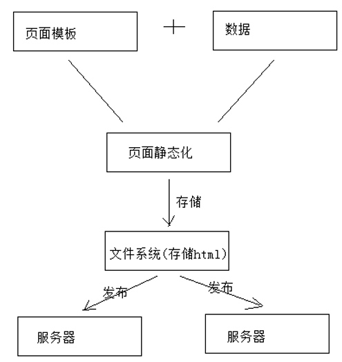

# 1. 静态化需求

1. **为什么进行页面管理?**

   本项目cms系统的功能就是根据运营需要，对门户等子系统的部分页面进行管理，从而实现快速根据用户需求修改页面内容并上线的需求。

2. **如何修改页面内容?**

   在开发中修改页面内容是需要人工编写html及JS文件，CMS系统是通过程序自动化的对页面内容进行修改，通过页面静态化技术生成html页面。

3. **如何进行页面静态化?**

   一个页面等于模板加数据，在添加页面的时候我们选择了页面的模板。

4. **页面静态化流程?**



业务流程执行如下:

1. 获取模型数据
2. 制作模板
3. 对页面进行静态化
4. 将静态化生成的html页面存放文件系统中
5. 将存放在文件系统的html文件发布到服务器

# 2. FreeMarker

## 2.1 概述

**FreeMarker**是一个基于[Java](https://zh.wikipedia.org/wiki/Java)的[模板引擎](https://zh.wikipedia.org/wiki/%E6%A8%A1%E6%9D%BF%E5%BC%95%E6%93%8E)，最初专注于使用[MVC](https://zh.wikipedia.org/wiki/Model-view-controller)[软件架构](https://zh.wikipedia.org/wiki/%E8%BD%AF%E4%BB%B6%E6%9E%B6%E6%9E%84)生成动态网页。但是，它是一个通用的模板引擎，不依赖于[servlet](https://zh.wikipedia.org/wiki/Servlet)s或[HTTP](https://zh.wikipedia.org/wiki/HTTP)或[HTML](https://zh.wikipedia.org/wiki/HTML)，因此它通常用于生成源代码，配置文件或电子邮件。


常用的java模板引擎还有哪些？

Jsp、Freemarker、Thymeleaf 、Velocity 等。

## 2.2 操作流程

### 2.2.1 定义模板

```html
<html>
<head>
  <title>Welcome!</title>
</head>
<body>
  <h1>Welcome ${user}!</h1>
  <p>Our latest product:
  <a href="${latestProduct.url}">${latestProduct.name}</a>!
</body>
</html>
```

### 2.2.2 定义数据

```json
(root)
  |
  +- user = "Big Joe"
  |
  +- latestProduct
      |
      +- url = "products/greenmouse.html"
      |
      +- name = "green mouse"
```

### 2.2.3 输出HTML

```html
<html>
<head>
  <title>Welcome!</title>
</head>
<body>
  <h1>Welcome John Doe!</h1>
  <p>Our latest product:
  <a href="products/greenmouse.html">green mouse</a>!
</body>
</html>
```

## 2.3 快速入门

freemarker作为springmvc一种视图格式，默认情况下SpringMVC支持freemarker视图格式。

### 2.3.1 创建工程

创建```SpringBoot```工程,集成```FreeMarker```启动器

pom.xml

```xml
<parent>
    <artifactId>xc-framework-parent</artifactId>
    <groupId>com.xuecheng</groupId>
    <version>1.0-SNAPSHOT</version>
    <relativePath>../xc-framework-parent/pom.xml</relativePath>
</parent>
<modelVersion>4.0.0</modelVersion>

<artifactId>test-freemarker</artifactId>
<dependencies>
    <dependency>
        <groupId>org.springframework.boot</groupId>
        <artifactId>spring-boot-starter-freemarker</artifactId>
    </dependency>
    <dependency>
        <groupId>org.springframework.boot</groupId>
        <artifactId>spring-boot-starter-web</artifactId>
    </dependency>
    <dependency>
        <groupId>org.projectlombok</groupId>
        <artifactId>lombok</artifactId>
    </dependency>
    <dependency>
        <groupId>com.squareup.okhttp3</groupId>
        <artifactId>okhttp</artifactId>
    </dependency>
    <dependency>
        <groupId>org.springframework.boot</groupId>
        <artifactId>spring-boot-starter-test</artifactId>
    </dependency>
    <dependency>
        <groupId>org.apache.commons</groupId>
        <artifactId>commons-io</artifactId>
    </dependency>
</dependencies>
```

### 2.3.2 配置文件

application.yml:配置参数

```yaml
server:
  port: 8088 #服务端口
spring:
 application:
    name: test‐freemarker #指定服务名
 freemarker:
   cache: false  #关闭模板缓存，方便测试
   settings:
     template_update_delay: 0 #检查模板更新延迟时间，设置为0表示立即检查，如果时间大于0会有缓存不方便进行模板测试
```

logback-spring.xml:日志文件

### 2.3.3 模型类

```java
@Data
@ToString
public class Student {
    private String name;//姓名
    private int age;//年龄
    private Date birthday;//生日
    private Float money;//钱包
    private List<Student> friends;//朋友列表
    private Student bestFriend;//最好的朋友
}
```

### 2.3.4 创建模板

位置:templates/test1.ftl

```java
<!DOCTYPE html>
<html>
<head>
    <meta charset="utf‐8">
    <title>Hello World!</title>
</head>
<body>
Hello ${name}!
</body>
</html>
```

### 2.3.4 创建Controller

```java
@RequestMapping("/freemarker")
@Controller
public class FreemarkerController {

    @RequestMapping("/test1")
    public String freemarker(Map<String, Object> map){
        map.put("name","黑马程序员");
        //返回模板文件名称
        return "test1";
    }
}
```

### 2.3.5 启动类

```java
@SpringBootApplication
public class FreemarkerTestApplication {
    public static void main(String[] args) {
        SpringApplication.run(FreemarkerTestApplication.class,args);
    }
}
```

## 2.4 基础语法

1. 注释，即<#‐‐和‐‐>，介于其之间的内容会被```freemarker```忽略
2. 插值（Interpolation）：即```${..}```部分,```freemarker```会用真实的值代替${..}
3. FTL指令：和`HTML`标记类似，名字前加#予以区分，`Freemarker`会解析标签中的表达式或逻辑。
4. 文本，仅文本信息，这些不是freemarker的注释、插值、FTL指令的内容会被freemarker忽略解析，直接输出内容

### 2.4.1 指令

#### 2.4.1.1 List指令

```java
map.put("stus",stus);
```

```html
<#list stus as stu>
    <tr>
        <td>${stu_index + 1}</td>
        <td>${stu.name}</td>
        <td>${stu.age}</td>
        <td>${stu.mondy}</td>
    </tr>
</#list>
```

#### 2.4.1.2 if指令

```java
<#list stus as stu>
    <tr>
        <td <#if stu.name =='小明'>style="background:red;"</#if>>${stu.name}</td>
        <td>${stu.age}</td>
        <td >${stu.mondy}</td>
    </tr>
</#list>
```

#### 2.4.1.3 空值判断

1. 判断stus是否为空

```html
<#if stus??>
    <#list stus as stu>
     ......    
    </#list>
</#if>
```

2. 值为空时,输出默认值

```html
${(stu.bestFriend.name)!''}
```

### 2.4.2 内建函数

#### 2.4.2.1 集合大小

```html
${集合名?size}
```

#### 2.4.2.2 日期格式化

```html
显示年月日: ${today?date}
显示时分秒：${today?time}  
显示日期+时间：${today?datetime} <br>       
自定义格式化：  ${today?string("yyyy年MM月")}
```

#### 2.4.2.3 格式化数字

```java
map.put("point", 102920122);
```

```html
${point?c}
```

## 2.4 静态化测试

### 2.4.1 基于模板测试

```java
public void testGenerateHtml() throws IOException, TemplateException {
    //创建配置类
    Configuration configuration=new Configuration(Configuration.getVersion());
    String classpath = this.getClass().getClassLoader().getResource("\\").getPath();
    //设置模板路径
    configuration.setDirectoryForTemplateLoading(new File(classpath + "/templates/"));
    //设置字符集
    configuration.setDefaultEncoding("utf-8");
    //加载模板
    Template template = configuration.getTemplate("test1.ftl");
    //数据模型
    Map map = getMap();
    //静态化
    String content = FreeMarkerTemplateUtils.processTemplateIntoString(template, map);
    //静态化内容
    System.out.println(content);
    InputStream inputStream = IOUtils.toInputStream(content);
    //输出文件
    FileOutputStream fileOutputStream = new FileOutputStream(new File("XXXX\\test1.html"));
    int copy = IOUtils.copy(inputStream, fileOutputStream);
}
```

### 2.4.2 基于模板字符串

```java
public void testGenerateHtmlByString() throws IOException, TemplateException {
    //创建配置类
    Configuration configuration=new Configuration(Configuration.getVersion());
    //获取模板内容
    //模板内容，这里测试时使用简单的字符串作为模板
    String templateString="" +
            "<html>\n" +
            "    <head></head>\n" +
            "    <body>\n" +
            "    名称：${name}\n" +
            "    </body>\n" +
            "</html>";

    //加载模板
    //模板加载器
    StringTemplateLoader stringTemplateLoader = new StringTemplateLoader();
    stringTemplateLoader.putTemplate("template",templateString);
    configuration.setTemplateLoader(stringTemplateLoader);
    Template template = configuration.getTemplate("template","utf-8");

    //数据模型
    Map map = getMap();
    //静态化
    String content = FreeMarkerTemplateUtils.processTemplateIntoString(template, map);
    //静态化内容
    System.out.println(content);
    InputStream inputStream = IOUtils.toInputStream(content);
    //输出文件
    FileOutputStream fileOutputStream = new FileOutputStream(new File("d:/test1.html"));
    IOUtils.copy(inputStream, fileOutputStream);
}
```


# 3. 页面静态化

# 4. 页面浏览

