# 1. Spring Cloud

## 1.1 概述

随着互联网和云计算的快速发展，企业的IT环境和架构风格也逐渐在发生变革。从过去的单体应用架构发展为至今广泛流行的的微服务架构。**微服务是一种架构风格,能给软件应用带来很大的便利。**但是微服务的实施和落地会面临很大的挑战，因此需要一套完整的微服务解决方案。在Java领域,Spring框架的出现给Java企业级应用开发带来了福音，提高了开发效率。在2014年低，Spring团队推出了Spring Cloud，目标使其成为Java领域微服务架构落地的标准，发展至今，Spring Cloud已经成为Java领域落地微服务架构的完成解决方案，为企业IT架构变革保驾护航。

## 1.2 应用架构的发展


* 单体架构：一个Java Web应用程序包含表现层、业务层、数据访问层。

* 分布式架构：按照业务将应用垂直切分，每个应用都是单体架构，各应用通过API相互调用

* SOA：也是一种分布式架构，不同业务建立不同的服务，服务之间通过API进行调用，注重服务的独立性和重用性。

  SOA有两个主要角色，服务的提供者和服务的消费者。阿里的Dubbo就是SOA的经典实现。

* 微服务：微服务一种架构风格，对于大型的业务系统，可以拆分为多个相互独立的微服务，各个微服务是松耦合的，通过各种远程协议进行同步/异步通信，各微服务均可以独立部署、扩/缩容以及升降机。

## 1.3 Spring Cloud

Spring Cloud是一个开源项目集合，包括很多子项目。基于Spring Boot开发，提供一套完整的Java领域的微服务解决方案。包括服务的注册与发现、配置中心、全链路监控、API网关、熔断器等选型中立的开源组件，可以随需扩展和替换组装。

Spring Cloud的子项目居多,每个子项目有自己的版本号，为了对Spring Cloud整体进行版本编号，确定一个可用于生产的版本标识。这些版本号采用伦敦地铁站的名字，按名称首字母排序，比如Dalston版、Edgware版，Finchley等。一般也会简称为D版、E版、F版等。

## 1.4 Spring Cloud组件列表

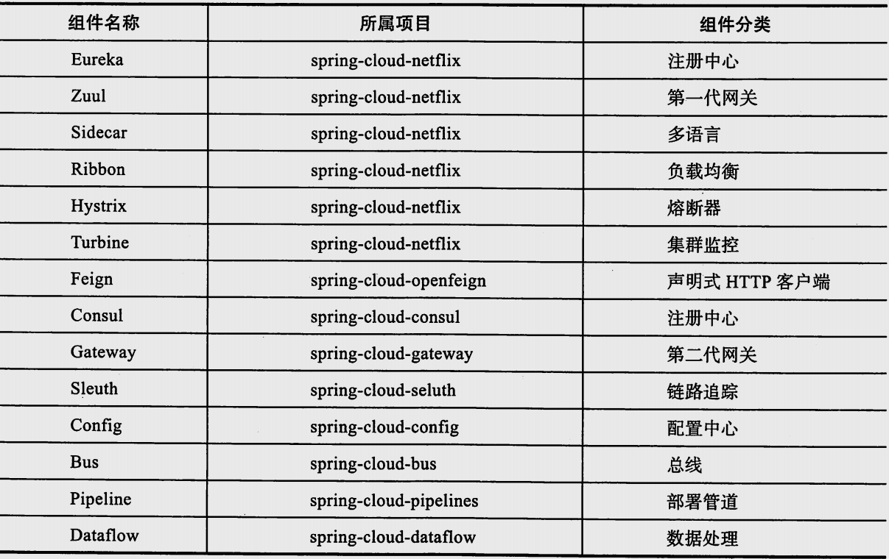

# 2. EureKa注册中心

## 2.1 需求分析

在前后端分离架构中，服务层被拆分成了很多的微服务，微服务的信息如何管理？Spring Cloud中提供服务注册中心来管理微服务信息。

为什么 要用注册中心？

1. 微服务数量众多，要进行远程调用就需要知道服务端的ip地址和端口，注册中心帮助我们管理这些服务的ip和端口。
2. 微服务会实时上报自己的状态，注册中心统一管理这些微服务的状态，将存在问题的服务踢出服务列表，客户端获取到可用的服务进行调用。

## 2.2 Eureka 注册中心

### 2.2.1 Eureka介绍

Spring Cloud Eureka 是对Netflix公司的Eureka的二次封装，它实现了服务治理的功能，Spring Cloud Eureka提供服务端与客户端，服务端即是Eureka服务注册中心，客户端完成微服务向Eureka服务的注册与发现。服务端和客户端均采用Java语言编写。下图显示了Eureka Server与Eureka Client的关系：

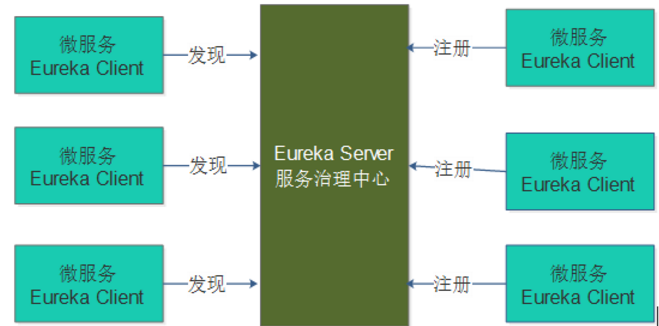

1. Eureka Server是服务端，负责管理各各微服务结点的信息和状态。
2. 在微服务上部署Eureka Client程序，远程访问Eureka Server将自己注册在Eureka Server。
3. 微服务需要调用另一个微服务时从Eureka Server中获取服务调用地址，进行远程调用。

### 2.2.2 Eureka Server搭建

#### 2.2.2.1 单机环境搭建

1. 创建xc-govern-center工程

   包结构：com.xuecheng.govern.center

2. 添加依赖

   在父工程添加：（有了则不用重复添加）

```xml
<dependency>
    <groupId>org.springframework.cloud</groupId>
    <artifactId>spring‐cloud‐dependencies</artifactId>
    <version>Finchley.SR1</version>
    <type>pom</type>
    <scope>import</scope>
</dependency>
```

​	在Eureka Server工程添加：

```xml
<dependencies>
    <!‐‐ 导入Eureka服务的依赖 ‐‐>
    <dependency>
         <groupId>org.springframework.cloud</groupId>
         <artifactId>spring‐cloud‐starter‐netflix‐eureka‐server</artifactId>
    </dependency>
</dependencies>
```

3. 启动类

```java
@EnableEurekaServer//标识这是一个Eureka服务
@SpringBootApplication
public class GovernCenterApplication {
    public static void main(String[] args) {
        SpringApplication.run(GovernCenterApplication.class, args);
    }
}
```

4. @EnableEurekaServer

   需要在启动类上用@EnableEurekaServer标识此服务为Eureka服务

5. 从其它服务拷贝application.yml和logback-spring.xml。

   application.yml的配置内容如下：

```yaml
server:
  port: 50101 #服务端口
spring:
  application:
    name: xc‐govern‐center #指定服务名
eureka:
  client:
    registerWithEureka: false #服务注册，是否将自己注册到Eureka服务中
    fetchRegistry: false #服务发现，是否从Eureka中获取注册信息
    serviceUrl: #Eureka客户端与Eureka服务端的交互地址，高可用状态配置对方的地址，单机状态配置自己（如果不配置则默认本机8761端口）
      defaultZone: http://localhost:50101/eureka/
  server:
    enable‐self‐preservation: false #是否开启自我保护模式
    eviction‐interval‐timer‐in‐ms: 60000 #服务注册表清理间隔（单位毫秒，默认是60*1000）
```

> registerWithEureka：被其它服务调用时需向Eureka注册
> fetchRegistry：需要从Eureka中查找要调用的目标服务时需要设置为true
> serviceUrl.defaultZone 配置上报Eureka服务地址，高可用状态配置对方的地址，单机状态配置自己
> enable-self-preservation：自保护设置。
> eviction-interval-timer-in-ms：清理失效结点的间隔，在这个时间段内如果没有收到该结点的上报则将结点从服务列表中剔除。

6. 启动Eureka Server

   启动Eureka Server，浏览50101端口。

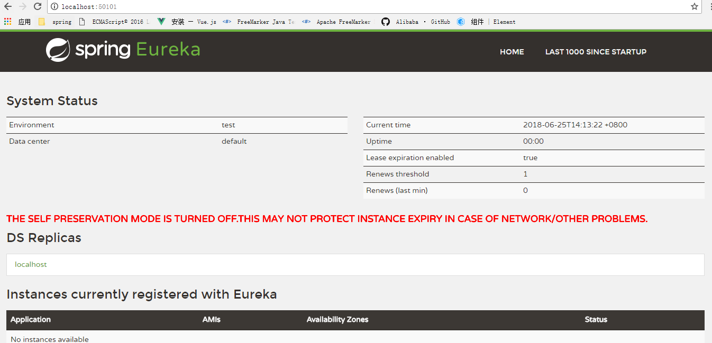

说明：

> 上图红色提示信息：
> THE SELF PRESERVATION MODE IS TURNED OFF.THIS MAY NOT PROTECT INSTANCE EXPIRY IN CASE OF
> NETWORK/OTHER PROBLEMS.
> 自我保护模式被关闭。在网络或其他问题的情况下可能不会保护实例失效。

Eureka Server有一种自我保护模式，当微服务不再向Eureka Server上报状态，Eureka Server会从服务列表将此服务删除，如果出现网络异常情况（微服务正常），此时Eureka server进入自保护模式，不再将微服务从服务列表删除。

在开发阶段建议关闭自保护模式。

#### 2.2.2.2 高可用环境搭建

Eureka Server 高可用环境需要部署两个Eureka server，它们互相向对方注册。如果在本机启动两个Eureka需要注意两个Eureka Server的端口要设置不一样，这里我们部署一个Eureka Server工程，将端口可配置，制作两个Eureka Server启动脚本，启动不同的端口，如下图：

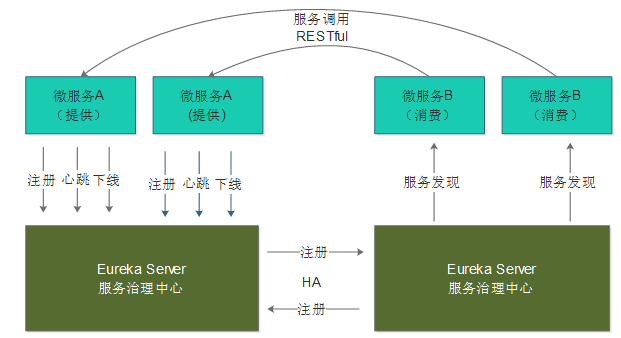

1. 在实际使用时Eureka Server至少部署两台服务器，实现高可用。
2. 两台Eureka Server互相注册。
3. 微服务需要连接两台Eureka Server注册，当其中一台Eureka死掉也不会影响服务的注册与发现。
4. 微服务会定时向Eureka server发送心跳，报告自己的状态。
5. 微服务从注册中心获取服务地址以RESTful方式发起远程调用。

**配置如下**

1. 端口可配置

```yaml
server:
  port: ${PORT:50101} #服务端口
```

2. Eureka服务端的交互地址可配置

```yaml
eureka:
  client:
    registerWithEureka: true #服务注册，是否将自己注册到Eureka服务中
    fetchRegistry: true #服务发现，是否从Eureka中获取注册信息
    serviceUrl: #Eureka客户端与Eureka服务端的交互地址，高可用状态配置对方的地址，单机状态配置自己（如果不配置则默认本机8761端口）
      defaultZone: ${EUREKA_SERVER:http://eureka02:50102/eureka/}
```

3. 配置hostname

   Eureka 组成高可用，两个Eureka互相向对方注册，这里需要通过域名或主机名访问，这里我们设置两个Eureka服务的主机名分别为 eureka01、eureka02。

完整的eureka配置如下：

```yaml
eureka:
  client:
    registerWithEureka: true #服务注册，是否将自己注册到Eureka服务中
    fetchRegistry: true #服务发现，是否从Eureka中获取注册信息
    serviceUrl: #Eureka客户端与Eureka服务端的交互地址，高可用状态配置对方的地址，单机状态配置自己（如果
不配置则默认本机8761端口）
      defaultZone: ${EUREKA_SERVER:http://eureka02:50102/eureka/}
  server:
    enable‐self‐preservation: false #是否开启自我保护模式
    eviction‐interval‐timer‐in‐ms: 60000 #服务注册表清理间隔（单位毫秒，默认是60*1000）
  instance:
    hostname: ${EUREKA_DOMAIN:eureka01}
```

4. 在IDEA中制作启动脚本

   启动1：


​	启动2:


运行两个启动脚本，分别浏览：

​	http://localhost:50101/
​	http://localhost:50102/

Eureka 主画面如下：

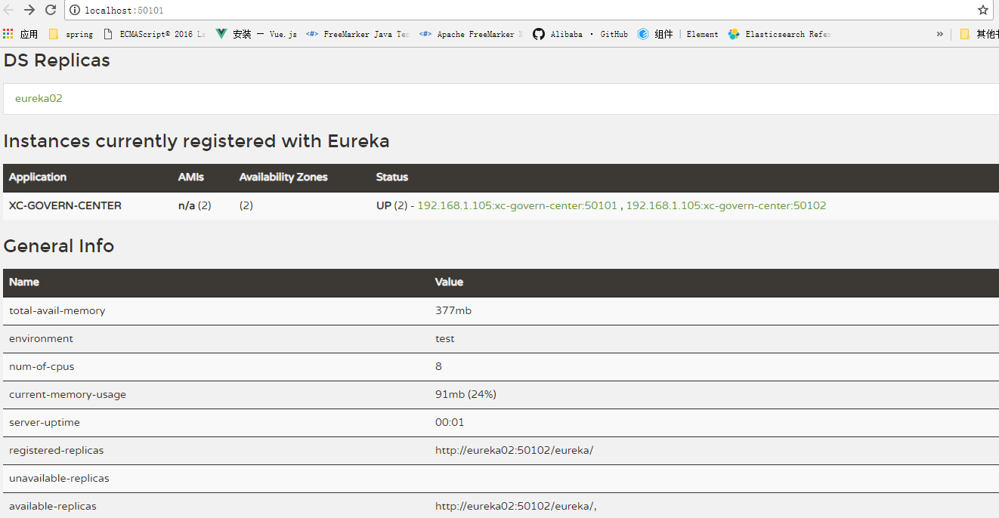

### 2.2.3 服务注册

#### 2.2.3.1 将cms注册到Eureka Server

下边实现cms向Eureka Server注册。

1. 在cms服务中添加依赖

```xml
<!‐‐ 导入Eureka客户端的依赖 ‐‐>
<dependency>
	<groupId>org.springframework.cloud</groupId>    
	<artifactId>spring‐cloud‐starter‐netflix‐eureka‐client</artifactId>    
</dependency>
```

2. 在application.yml配置

```yaml
eureka:
  client:
    registerWithEureka: true #服务注册开关
    fetchRegistry: true #服务发现开关
    serviceUrl: #Eureka客户端与Eureka服务端进行交互的地址，多个中间用逗号分隔
      defaultZone: ${EUREKA_SERVER:http://localhost:50101/eureka/}
  instance:
    prefer‐ip‐address:  true  #将自己的ip地址注册到Eureka服务中
    ip‐address: ${IP_ADDRESS:127.0.0.1}
    instance‐id: ${spring.application.name}:${server.port} #指定实例id
```

3. 在启动类上添加注解

   在启动类上添加注解 @EnableDiscoveryClient ，表示它是一个Eureka的客户端

4. 刷新Eureka Server查看注册情况


#### 2.2.3.2 将manage-course注册到Eureka Server

方法同上:

1. 在manage-course工程中添加spring-cloud-starter-eureka依赖：
2. 在application.yml配置eureka
3. 在启动类上添加注解 @EnableDiscoveryClient

# 3. Feign远程调用

在前后端分离架构中，服务层被拆分成了很多的微服务，服务与服务之间难免发生交互，比如：课程发布需要调用CMS服务生成课程静态化页面，本节研究微服务远程调用所使用的技术。

下图是课程管理服务远程调用CMS服务的流程图：

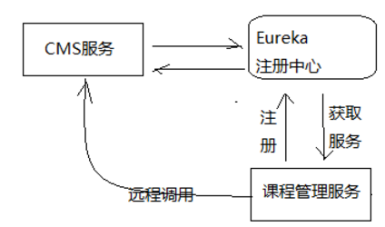

1. cms服务将自己注册到注册中心。
2. 课程管理服务从注册中心获取cms服务的地址。
3. 课程管理服务远程调用cms服务。

## 3.1 Ribbon

### 3.1.1 Ribbon介绍

Ribbon是Netflix公司开源的一个负载均衡的项目（https://github.com/Netflix/ribbon），它是一个基于 HTTP、TCP的客户端负载均衡器。

1. 什么是负载均衡？

   负载均衡是微服务架构中必须使用的技术，通过负载均衡来实现系统的高可用、集群扩容等功能。负载均衡可通过硬件设备及软件来实现，硬件比如：F5、Array等，软件比如：LVS、Nginx等。

   如下图是负载均衡的架构图：

   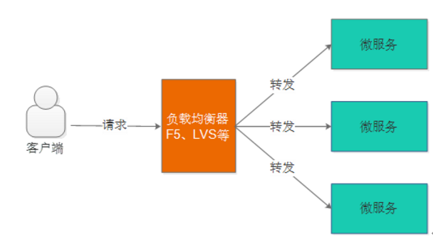

   用户请求先到达负载均衡器（也相当于一个服务），负载均衡器根据负载均衡算法将请求转发到微服务。负载均衡算法有：轮训、随机、加权轮训、加权随机、地址哈希等方法，负载均衡器维护一份服务列表，根据负载均衡算法将请求转发到相应的微服务上，所以负载均衡可以为微服务集群分担请求，降低系统的压力。

2. 什么是客户端负载均衡？

   上图是服务端负载均衡，客户端负载均衡与服务端负载均衡的区别在于客户端要维护一份服务列表，Ribbon从Eureka Server获取服务列表，Ribbon根据负载均衡算法直接请求到具体的微服务，中间省去了负载均衡服务。

   如下图是Ribbon负载均衡的流程图：

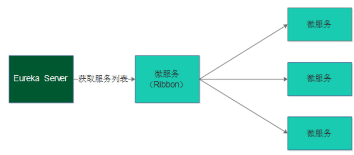

1. 在消费微服务中使用Ribbon实现负载均衡，Ribbon先从EurekaServer中获取服务列表。
2. Ribbon根据负载均衡的算法去调用微服务。

### 3.1.2 Ribbon测试

Spring Cloud引入Ribbon配合 restTemplate 实现客户端负载均衡。Java中远程调用的技术有很多，如：webservice、socket、rmi、Apache HttpClient、OkHttp等，互联网项目使用基于http的客户端较多，本项目使用OkHttp。

1. 在客户端添加Ribbon依赖：

   这里在课程管理服务配置ribbon依赖

```xml
<dependency>
    <groupId>org.springframework.cloud</groupId>
    <artifactId>spring‐cloud‐starter‐ribbon</artifactId>
</dependency>
<dependency>
    <groupId>com.squareup.okhttp3</groupId>
    <artifactId>okhttp</artifactId>
</dependency>
```

​	由于依赖了spring-cloud-starter-eureka，会自动添加spring-cloud-starter-ribbon依赖


2. 配置Ribbon参数

   这里在课程管理服务的application.yml中配置ribbon参数

```yaml
ribbon:
  MaxAutoRetries: 2 #最大重试次数，当Eureka中可以找到服务，但是服务连不上时将会重试
  MaxAutoRetriesNextServer: 3 #切换实例的重试次数
  OkToRetryOnAllOperations: false  #对所有操作请求都进行重试，如果是get则可以，如果是post，put等操作
没有实现幂等的情况下是很危险的,所以设置为false
  ConnectTimeout: 5000  #请求连接的超时时间
  ReadTimeout: 6000 #请求处理的超时时间
```

3. 负载均衡测试

   启动两个cms服务，注意端口要不一致

   启动完成观察Eureka Server的服务列表


​	定义RestTemplate，使用@LoadBalanced注解

​	在课程管理服务的启动类中定义RestTemplate

```java
@Bean
@LoadBalanced
public RestTemplate restTemplate() {
    return new RestTemplate(new OkHttp3ClientHttpRequestFactory());
}
```

​	测试代码

​	在课程管理服务工程创建单元测试代码，远程调用cms的查询页面接口：

```java
//负载均衡调用
@Test
public void testRibbon() {
    //服务id
    String serviceId = "XC‐SERVICE‐MANAGE‐CMS";
    for(int i=0;i<10;i++){
        //通过服务id调用
        ResponseEntity<CmsPage> forEntity = restTemplate.getForEntity("http://" + serviceId
+ "/cms/page/get/5a754adf6abb500ad05688d9", CmsPage.class);
        CmsPage cmsPage = forEntity.getBody();
        System.out.println(cmsPage);
    }
}
```

4. 负载均衡测试

   添加@LoadBalanced注解后，restTemplate会走LoadBalancerInterceptor拦截器，此拦截器中会通过RibbonLoadBalancerClient查询服务地址，可以在此类打断点观察每次调用的服务地址和端口，两个cms服务会轮流被调用。

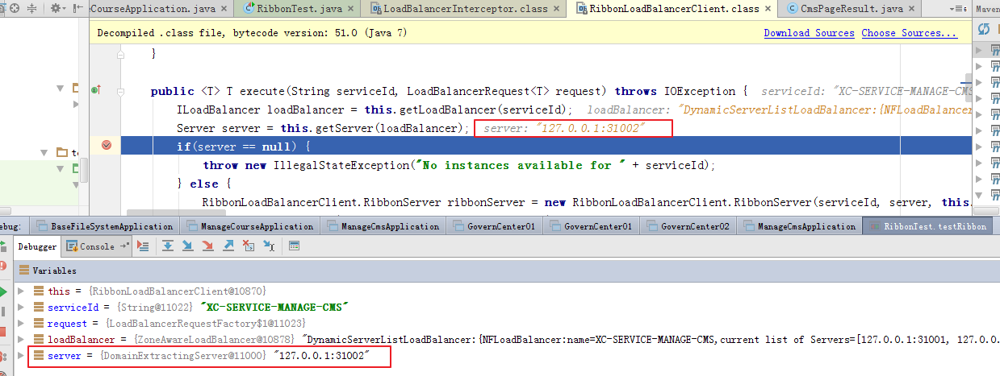

## 3.2 Feign

### 3.2.1 Feign介绍

Feign是Netflix公司开源的轻量级rest客户端，使用Feign可以非常方便的实现Http 客户端。Spring Cloud引入Feign并且集成了Ribbon实现客户端负载均衡调用。

### 3.2.2 Feign测试

1. 在客户端添加依赖

   在课程管理服务添加下边的依赖：

```xml
<dependency>
<groupId>org.springframework.cloud</groupId>    
<artifactId>spring‐cloud‐starter‐openfeign</artifactId>    
</dependency>
<dependency>
    <groupId>com.netflix.feign</groupId>
    <artifactId>feign‐okhttp</artifactId>
</dependency>
```

2. 定义FeignClient接口

   参考Swagger文档定义FeignClient，注意接口的Url、请求参数类型、返回值类型与Swagger接口一致。在课程管理服务中创建client包，定义查询cms页面的客户端该用接口

```java
@FeignClient(value = XcServiceList.XC_SERVICE_MANAGE_CMS)
public interface CmsPageClient {
    @GetMapping("/cms/page/get/{id}")
    public CmsPage findById(@PathVariable("id") String id);
}
```

3. 启动类添加@EnableFeignClients注解

4. 测试

```java
@RunWith(SpringRunner.class)
@SpringBootTest
public class FeignTest {
    @Autowired
    CmsPageClient cmsPageClient;
    @Test
    public void testFeign() {
        //通过服务id调用cms的查询页面接口
        CmsPage cmsPage = cmsPageClient.findById("5a754adf6abb500ad05688d9");
        System.out.println(cmsPage);
    }
}
```

Feign 工作原理如下：

1. 启动类添加@EnableFeignClients注解，Spring会扫描标记了@FeignClient注解的接口，并生成此接口的代理对象
2. @FeignClient(value = XcServiceList.XC_SERVICE_MANAGE_CMS)即指定了cms的服务名称，Feign会从注册中心获取cms服务列表，并通过负载均衡算法进行服务调用。
3. 在接口方法 中使用注解@GetMapping("/cms/page/get/{id}")，指定调用的url，Feign将根据url进行远程调用。

### 3.2.3 Feign注意点

SpringCloud对Feign进行了增强兼容了SpringMVC的注解 ，我们在使用SpringMVC的注解时需要注意：

1. feignClient接口 有参数在参数必须加@PathVariable("XXX")和@RequestParam("XXX")
2. feignClient返回值为复杂对象时其类型必须有无参构造函数。

# 4. 课程预览技术方案

## 4.1 需求分析

课程预览是为了保证课程发布后的正确性，通过课程预览可以直观的通过课程详情页面看到课程的信息是否正确，通过课程预览看到的页面内容和课程发布后的页面内容是一致的。

下图是课程详情页面的预览图：

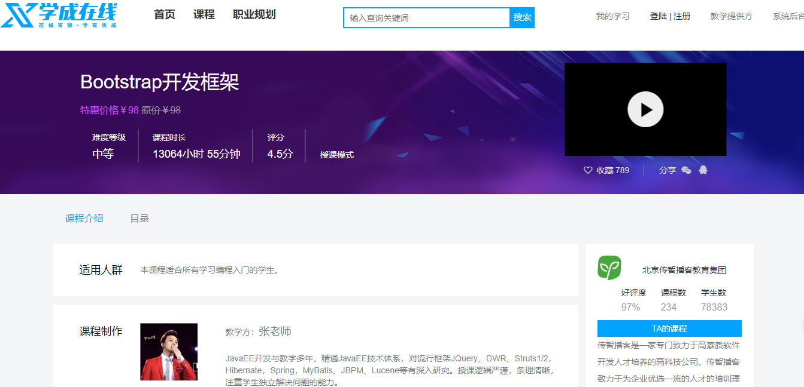

## 4.2 课程详情页面技术方案

课程预览所浏览到的页面就是课程详情页面，需要先确定课程详情页面的技术方案后方可确定课程预览的技术方案。

### 4.2.1 技术需求

课程详情页面是向用户展示课程信息的窗口，课程相当于网站的商品，本页面的访问量会非常大。此页面的内容设计不仅要展示出课程核心重要的内容而且用户访问页面的速度要有保证，有统计显示打开一个页面超过4秒用户就走掉了，所以本页面的性能要求是本页面的重要需求。

本页面另一个需求就是SEO，要非常有利于爬虫抓取页面上信息，并且生成页面快照，利于用户通过搜索引擎搜索课程信息。

### 4.2.2 解决方案

如何在保证SEO的前提下提高页面的访问速度 

**方案1：**

对于信息获取类的需求，要想提高页面速度就要使用缓存来减少或避免对数据库的访问，从而提高页面的访问速度。下图是使用缓存与不使用缓存的区别

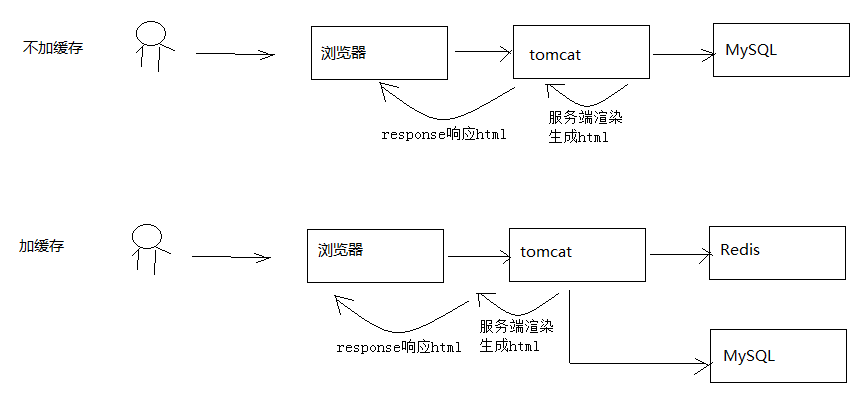

此页面为动态页面，会根据课程的不同而不同，方案一采用传统的JavaEE Servlet/jsp的方式在Tomcat完成页面渲染，相比不加缓存速度会有提升。

优点：使用redis作为缓存，速度有提升。

缺点：采用Servlet/jsp动态页面渲染技术，服务器使用Tomcat，面对高并发量的访问存在性能瓶颈。

**方案2：**

对于不会频繁改变的信息可以采用页面静态化的技术，提前让页面生成html静态页面存储在nginx服务器，用户直接访问nginx即可，对于一些动态信息可以访问服务端获取json数据在页面渲染。

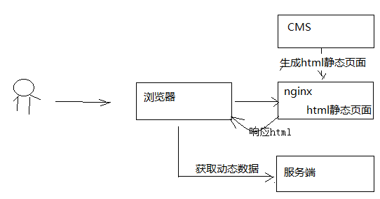

优点：使用Nginx作为web服务器，并且直接访问html页面，性能出色。

缺点：需要维护大量的静态页面，增加了维护的难度。

选择方案2作为课程详情页面的技术解决方案，将课程详情页面生成Html静态化页面，并发布到Nginx上。

## 4.3  课程预览技术方案

根据要求：课程详情页面采用静态化技术生成Html页面，课程预览的效果要与最终静态化的Html页面内容一致。

所以，课程预览功能也采用静态化技术生成Html页面，课程预览使用的模板与课程详情页面模板一致，这样就可以保证课程预览的效果与最终课程详情页面的效果一致。

操作流程：

1. 制作课程详情页面模板
2. 开发课程详情页面数据模型的查询接口（为静态化提供数据）
3. 调用cms课程预览接口通过浏览器浏览静态文件

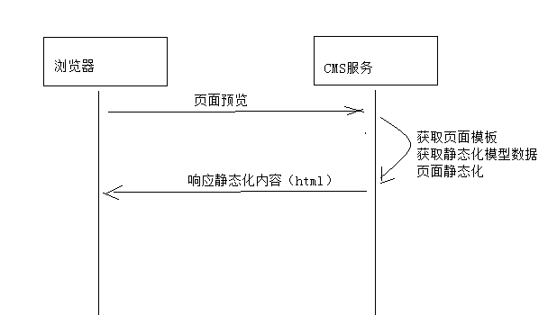

# 5. 课程详情页面静态化

## 5.1 静态页面测试

### 5.1.1 页面内容组成

我们在编写一个页面时需要知道哪些信息是静态信息，哪些信息为动态信息，下图是页面的设计图：

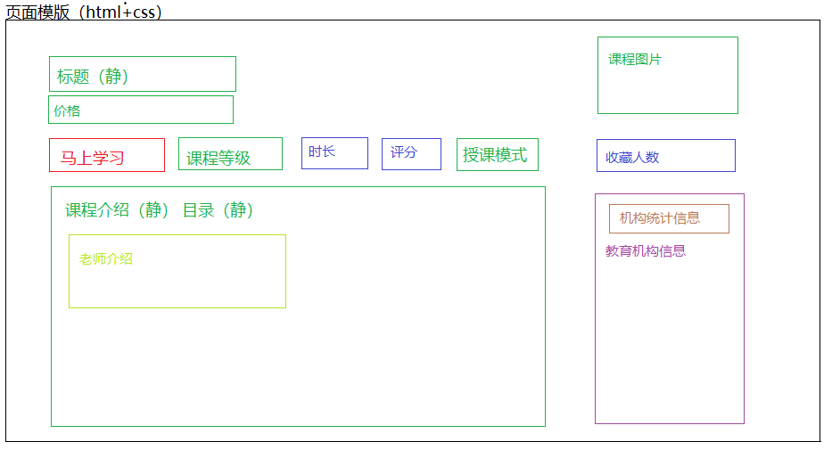

打开静态页面，观察每部分的内容。

红色表示动态信息，红色以外表示静态信息。

红色动态信息：表示一个按钮，根据用户的登录状态、课程的购买状态显示按钮的名称及按钮的事件。
包括以下信息内容：

1. 课程信息
   课程标题、价格、课程等级、授课模式、课程图片、课程介绍、课程目录。
2. 课程统计信息
   课程时长、评分、收藏人数
3. 教育机构信息
   公司名称、公司简介
4. 教育机构统计信息
   好评数、课程数、学生人数
5. 教师信息
   老师名称、老师介绍

### 5.1.2 页面拆分

将页面拆分成如下页面：

1. 页头

   本页头文件和门户使用的页头为同一个文件。

   参考：代码\页面与模板\include\header.html

2. 页面尾

   本页尾文件和门户使用的页尾为同一个文件。

   参考：代码\页面与模板\include\footer.html

3. 课程详情主页面

   每个课程对应一个文件，命名规则为：课程id.html（课程id动态变化）

   模板页面参考：\代码\页面与模板\course\detail\course_main_template.html

4. 教育机构页面

   每个教育机构对应一个文件，文件的命名规则为：company_info_公司id.html（公司id动态变化）

   参考：代码\页面与模板\company\company_info_template.html

5. 老师信息页面

   每个教师信息对应一个文件，文件的命名规则为：teacher_info_教师id.html（教师id动态变化）

   参考：代码 \页面与模板\teacher\teacher_info_template01.html

6. 课程统计页面

   每个课程对应一个文件，文件的命名规则为：course_stat_课程id.json（课程id动态变化）

   参考：\代码\页面与模板\stat\course\course_stat_template.json

7. 教育机构统计页面

   每个教育机构对应一个文件，文件的命名规则为：company_stat_公司id.json（公司id动态变化）

   参考：\代码\页面与模板\stat\company\company_stat_template.json

### 5.1.3 静态页面测试

#### 5.1.3.1 页面加载思路

打开课程资料中的“静态页面目录”中的课程详情模板页面，研究页面加载的思路。

模板页面路径如下：

​	静态页面目录\static\course\detail\course_main_template.html

1. 主页面

   我们需要在主页面中通过SSI加载：页头、页尾、教育机构、教师信息

2. 异步加载课程统计与教育机构统计信息

   课程统计信息（json）、教育机构统计信息（json）

3. 马上学习按钮事件

   用户点击“马上学习”会根据课程收费情况、课程购买情况执行下一步操作。

#### 5.1.3.2 静态资源虚拟主机

1. 配置静态资源虚拟主机

   静态资源虚拟主机负责处理课程详情、公司信息、老师信息、统计信息等页面的请求：

   将课程资料中的“静态页面目录”中的目录拷贝到F:/develop/xuecheng/static下

   在nginx中配置静态虚拟主机如下：

```nginx
#学成网静态资源
server {
	listen       91;    
	server_name localhost;    
   
	#公司信息    
	location /static/company/ {      
		alias   F:/develop/xuecheng/static/company/; 
    }      
	#老师信息    
	location /static/teacher/ {      
		alias   F:/develop/xuecheng/static/teacher/;        
	}     
	#统计信息    
	location /static/stat/ {      
		alias   F:/develop/xuecheng/static/stat/;        
	}     
    #详细信息 
	location /course/detail/ {      
		alias  F:/develop/xuecheng/static/course/detail/;        
	}     
}
```

2. 通过www.xuecheng.com虚拟主机转发到静态资源

   由于课程页面需要通过SSI加载页头和页尾所以需要通过www.xuecheng.com虚拟主机转发到静态资源

   在www.xuecheng.com虚拟主机加入如下配置：

```nginx
location /static/company/ { 
	proxy_pass http://static_server_pool;        
}     
location /static/teacher/ {      
	proxy_pass http://static_server_pool;        
}     
location /static/stat/ {      
	proxy_pass http://static_server_pool;        
}     
location /course/detail/ {      
	proxy_pass http://static_server_pool;        
}
```

​	配置upstream实现请求转发到资源服务虚拟主机：

```nginx
#静态资源服务
upstream static_server_pool{
	server 127.0.0.1:91 weight=10;
}
```

#### 5.1.3.3 门户静态资源路径

门户中的一些图片、样式等静态资源统一通过/static路径对外提供服务，在www.xuecheng.com虚拟主机中配置如下：

```nginx
#静态资源，包括系统所需要的图片，js、css等静态资源    
location /static/img/ {      
	alias   F:/develop/xc_portal_static/img/; 
}      
location /static/css/ {      
	alias   F:/develop/xc_portal_static/css/;        
}     
location /static/js/ {      
	alias   F:/develop/xc_portal_static/js/;        
}     
location /static/plugins/ {      
	alias   F:/develop/xc_portal_static/plugins/;        
	add_header Access‐Control‐Allow‐Origin http://ucenter.xuecheng.com;          
	add_header Access‐Control‐Allow‐Credentials true;          
	add_header Access‐Control‐Allow‐Methods GET;        
}
```

cors 跨域参数：

Access-Control-Allow-Origin：允许跨域访问的外域地址
如果允许任何站点跨域访问则设置为*，通常这是不建议的。
Access-Control-Allow-Credentials： 允许客户端携带证书访问
Access-Control-Allow-Methods：允许客户端跨域访问的方法

#### 5.1.3.4 页面测试

请求：http://www.xuecheng.com/course/detail/course_main_template.html测试课程详情页面模板是否可以正常浏览。

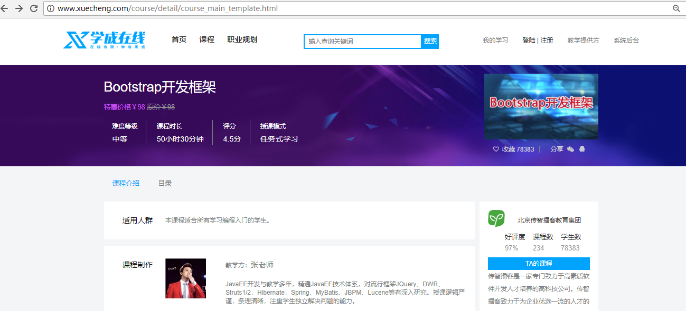

#### 5.1.3.5 页面动态脚本

为了方便日后的维护，我们将javascript实现的动态部分单独编写一个html 文件,在门户的include目录下定义course_detail_dynamic.html文件，此文件通过ssi包含在课程详情页面中.

文件地址：资料 \静态页面目录\include\course_detail_dynamic.html

所有的课程公用一个 页面动态脚本。

在课程详情主页面下端添加如下代码，通过SSI技术包含课程详情页面动态脚本文件：

```javascript
<script>var courseId = "template"</script>
<!‐‐#include virtual="/include/course_detail_dynamic.html"‐‐>
</body>
</html>
```

本页面使用vue.js动态获取信息，vue实例创建的代码如下：

主要查看 created钩子函数的内容。

```javascript
var body= new Vue({   //创建一个Vue的实例
    el: "#body", //挂载点是id="app"的地方
    data: {
        editLoading: false,
        title:'测试',
        courseId:'',
        charge:'',//203001免费,203002收费
        learnstatus:0,//课程状态，1：马上学习，2：立即报名、3：立即购买
        course:{},
        companyId:'template',
        company_stat:[],
        course_stat:{"s601001":"","s601002":"","s601003":""}
    },
    methods: {
        //学习报名
        addopencourse(){
            ...
        },
        //立即购买
        buy(){
            ...
        },
        createOrder(){
            ...
        },
        getLearnstatus(){//获取学习状态
            ...
        }
    },
   created() {
//this.charge = '203002'
        this.courseId = courseId;
                  //获取教育机构的统计数据
       queryCompanyStat(this.companyId).then((res)=>{
           console.log(res)
           if(res.stat){
               this.company_stat = res.stat
               console.log(this.company_stat)
           }
       })
       //获取课程的统计数据
       queryCourseStat(this.courseId).then((res)=>{
           console.log(res)
           if(res.stat){
               let stat = res.stat
              for(var i=0;i<stat.length;i++){
                  this.course_stat['s'+stat[i].id] = stat[i].value
              }
           }
           console.log(this.course_stat)
       })
    },
    mounted(){
       // alert(courseId)
    }
})
```

## 5.2 课程数据模型查询接口

静态化操作需要模型数据方可进行静态化，课程数据模型由课程管理服务提供，仅供课程静态化程序调用使用。

### 5.2.1 接口定义

1. 响应结果类型

```java
@Data
@ToString
@NoArgsConstructor
public class CourseView  implements Serializable  {
    CourseBase courseBase;//基础信息
    CourseMarket courseMarket;//课程营销
    CoursePic coursePic;//课程图片
    TeachplanNode TeachplanNode;//教学计划
}
```

2. 请求类型

   String ：课程id

3. 接口定义如下

```java
@ApiOperation("课程视图查询")
public CourseView courseview(String id);
```

### 5.2.2 Dao

需要对course_base、course_market、course_pic、teachplan等信息进行查询

新建课程营销的dao，其它dao已经存在不用再建。

```java
public interface CourseMarketRepository extends JpaRepository<CourseMarket,String> {
}
```

### 5.2.3 Service

```java
//课程视图查询
public CourseView getCoruseView(String id) {
    CourseView courseView = new CourseView();
    //查询课程基本信息
    Optional<CourseBase> optional = courseBaseRepository.findById(id);
    if(optional.isPresent()){
        CourseBase courseBase = optional.get();
        courseView.setCourseBase(courseBase);
    }
    //查询课程营销信息
    Optional<CourseMarket> courseMarketOptional = courseMarketRepository.findById(id);
    if(courseMarketOptional.isPresent()){
        CourseMarket courseMarket = courseMarketOptional.get();
        courseView.setCourseMarket(courseMarket);
    }
    //查询课程图片信息
    Optional<CoursePic> picOptional = coursePicRepository.findById(id);
    if(picOptional.isPresent()){
        CoursePic coursePic = picOptional.get();
        courseView.setCoursePic(picOptional.get());
    }
    //查询课程计划信息
    TeachplanNode teachplanNode = teachplanMapper.selectList(id);
    courseView.setTeachplanNode(teachplanNode);
    return courseView;
}
```

### 5.2.4 Controller

```java
@Override
@GetMapping("/courseview/{id}")
public CourseView courseview(@PathVariable("id") String id) {
    return courseService.getCoruseView(id);
}
```

### 5.2.5 测试

使用swagger-ui或postman测试本接口。

## 5.3 课程信息模板设计

在确定了静态化所需要的数据模型之后，就可以编写页面模板了，课程详情页面由多个静态化页面组成，所以我们需要创建多个页面模板，本章节创建课程详情页面的主模板，即课程信息模板。

### 5.3.1 模板内容

完整的模板请参考 “资料\课程详情页面模板\course.ftl“ 文件，下边列出模板中核心的内容：

1. 课程基本信息

```html
<div class="banner‐left">
            <p class="tit">${courseBase.name}</p>
            <p class="pic"><span class="new‐pic">特惠价格￥${courseMarket.price}</span> <span
class="old‐pic">原价￥${courseMarket.price_old!}</span></p>
            <p class="info">
                <a href="http://ucenter.xuecheng.com/#/learning/${courseBase.id}/0" 
target="_blank" v‐if="learnstatus == 1" v‐cloak>马上学习</a>
                <a href="#"  @click="addopencourse" v‐if="learnstatus == 2" v‐cloak>立即报名</a>
                <a href="#"  @click="buy" v‐if="learnstatus == 3" v‐cloak>立即购买</a>
                <span><em>难度等级</em>
 <#if courseBase.grade=='200001'>        
低级        
                <#elseif courseBase.grade=='200002'>
中级        
 <#elseif courseBase.grade=='200003'>        
高级        
</#if>        
                </span>
                <span><em>课程时长</em><stat v‐text="course_stat.s601001"></stat>
                </span>
                <span><em>评分</em><stat v‐text="course_stat.s601002"></stat></span>
                <span><em>授课模式</em>
                  <#if courseBase.studymodel=='201001'>
自由学习        
                <#elseif courseBase.studymodel=='201002'>
任务式学习        
</#if> 
                                      </span>
            </p>
        </div>
     <div class="banner‐rit">
    <#if coursePic.pic??>    
     <p>
</p>
   
     <#else>    
 <p> </p>        
    </#if>    
          
            <p class="vid‐act"><span> <i class="i‐heart"></i>收藏 <stat v‐
text="course_stat.s601003"></stat> </span> <span>分享 <i class="i‐weixin"></i><i class="i‐qq">
</i></span></p>
        </div>
```

2. 课程计划

```html
<div class="content">
<#if teachplanNode.children??>            
                            <#list teachplanNode.children as firstNode>
                                <div class="item">
                                    <div class="title act"><i class="i‐chevron‐top">
</i>${firstNode.pname}</div>
                                    <div class="about">${firstNode.description!}</div>
                                    <div class="drop‐down" style="height: ${firstNode.children?
size * 50}px;">
                                        <ul class="list‐box">
                                            <#list firstNode.children as secondNode>
                                                <li>${secondNode.pname}</li>
                                            </#list>
                                        </ul>
                                    </div>
                                </div>
                            </#list>
               </#if>
               
 </div>
```

3. 页头

   局部代码如下：

```html
<body data‐spy="scroll" data‐target="#articleNavbar" data‐offset="150"> 
<!‐‐ 页面头部 ‐‐>
<!‐‐#include virtual="/include/header.html"‐‐>
```

4. 页尾

```html
<!‐‐  页面底部 ‐‐>
<!‐‐底部版权‐‐>
<!‐‐#include virtual="/include/footer.html"‐‐>
```

5. 动态脚本文件：

```html
<script> 
    //课程id
    var courseId = "template"
</script>
<!‐‐#include virtual="/include/course_detail_dynamic.html"‐‐>
```

6. 教师信息文件：

   从课程数据中获取课程所属的教师Id，这里由于教师信息管理功能没有开发我们使用固定的教师信息文件：

```html
<div class="content‐com course">
    <div class="title"><span>课程制作</span></div>
    <!‐‐#include virtual="/teacher/teacher_info_template01.html"‐‐>
</div>
```

2. 教育机构文件：

   同教师信息一样，由于教育机构功能模块没有开发，这里我们使用固定的教育机构文件：

```html
<div class="about‐teach"> 
    <!‐‐机构信息‐‐>
    <!‐‐#include virtual="/company/company_info_template.html"‐‐>
</div>
```

### 5.3.2 模板测试

使用test-freemarker工程测试模板

编写模板过程采用test-freemarker工程测试模板。

将course.ftl拷贝到test-freemarker工程的resources/templates下，并在test-freemarker工程的controller中添加测试方法

```java
//课程详情页面测试
@RequestMapping("/course")
public String course(Map<String,Object> map){
    ResponseEntity<Map> forEntity =
restTemplate.getForEntity("http://localhost:31200/course/courseview/4028e581617f945f01617f9dabc4
0000", Map.class);
    Map body = forEntity.getBody();
    map.put("model",body);
    return "course";
}
```

注意：上边的测试页面不显示样式，原因是页面通过SSI包含了页面头，而使用test-freemarker工程无法加载页头，测试模板主要查看html页面内容是否正确，待课程预览时解决样式不显示问题。

### 5.3.3 模板保存

模板编写并测试通过后要在数据库保存：

1. 模板信息保存在xc_cms数据库(mongodb)的cms_template表
2. 模板文件保存在mongodb的GridFS中。

第一步：将模板文件上传到GridFS中

由于本教学项目中模板管理模块没有开发，所以我们使用Junit代码向GridFS中保存：

```java
// 文件存储2
@Test
public void testStore2() throws FileNotFoundException {
    File file = new File("C:\\Users\\admin\\Desktop\\course.ftl");
    FileInputStream inputStream = new FileInputStream(file);
    //保存模版文件内容
    GridFSFile gridFSFile = gridFsTemplate.store(inputStream, "课程详情模板文件","");
    String fileId = gridFSFile.getId().toString();
    System.out.println(fileId);
}
```

保存成功需要记录模板文件的id，即上边代码中的fileId。

第二步：向cms_template表添加模板记录（请不要重复添加）

使用Studio 3T连接mongodb，向cms_template添加记录：

```json
｛
  "_class" : "com.xuecheng.framework.domain.cms.CmsTemplate",
  "siteId" : "5a751fab6abb5044e0d19ea1",
  "templateName" : "课程详情页面正式模板",
  "templateFileId" : "这里填写上边代码返回的模板文件id"
｝
```

### 5.3.4 其它模板

除了课程详情主页面需要设计模板所有静态化的页面都要设计模板，如下：
教育机构页面模板、教师信息页面模板、课程统计信息json模板、教育机构统计信息json模板。
本项目我们实现课程详情主页面模板的制作和测试，其它页面模板的开发参考课程详情页面去实现。

# 6. 课程预览功能开发

## 6.1  需求分析

课程预览功能将使用cms系统提供的页面预览功能，业务流程如下：

1. 用户进入课程管理页面，点击课程预览，请求到课程管理服务
2. 课程管理服务远程调用cms添加页面接口向cms添加课程详情页面
3. 课程管理服务得到cms返回课程详情页面id，并拼接生成课程预览Url
4. 课程管理服务将课程预览Url给前端返回
5. 用户在前端页面请求课程预览Url，打开新窗口显示课程详情内容

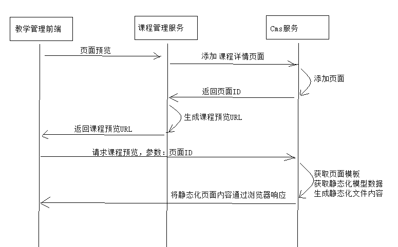

## 6.2 CMS 页面预览测试

CMS已经提供了页面预览功能，课程预览功能要使用CMS页面预览接口实现，下边通过cms页面预览接口测试课程预览的效果。

1. 向cms_page表插入一条页面记录或者从cms_page找一个页面进行测试。

   注意：页面配置一定要正确，需设置正确的模板id和dataUrl。

   如下，是一条页面的记录。

```json
{
    "_id" : ObjectId("5b3469f794db44269cb2bff1"),
    "_class" : "com.xuecheng.framework.domain.cms.CmsPage",
    "siteId" : "5a751fab6abb5044e0d19ea1",
    "pageName" : "4028e581617f945f01617f9dabc40000.html",
    "pageAliase" : "课程详情页面测试01",
    "pageWebPath" : "/course/detail/",
    "pagePhysicalPath" : "/course/detail/",
    "pageType" : "1",
    "pageCreateTime" : ISODate("2018‐02‐25T01:37:25.974+0000"),
    "templateId" : "5b345a6b94db44269cb2bfec",
    "dataUrl" : "http://localhost:31200/course/courseview/4028e581617f945f01617f9dabc40000"
}
```

2. 课程详细页面 使用ssi注意

   由于 Nginx先请求cms的课程预览功能得到html页面，再解析页面中的ssi标签，这里必须保证cms页面预览返回的页面的`Content-Type`为`text/html;charset=utf-8`

   在cms页面预览的controller方法中添加：

```java
response.setHeader("Content‐type","text/html;charset=utf‐8");
```

3. 测试

   请求：http://www.xuecheng.com/cms/preview/5b3469f794db44269cb2bff1传入页面 Id，测试效果如下:

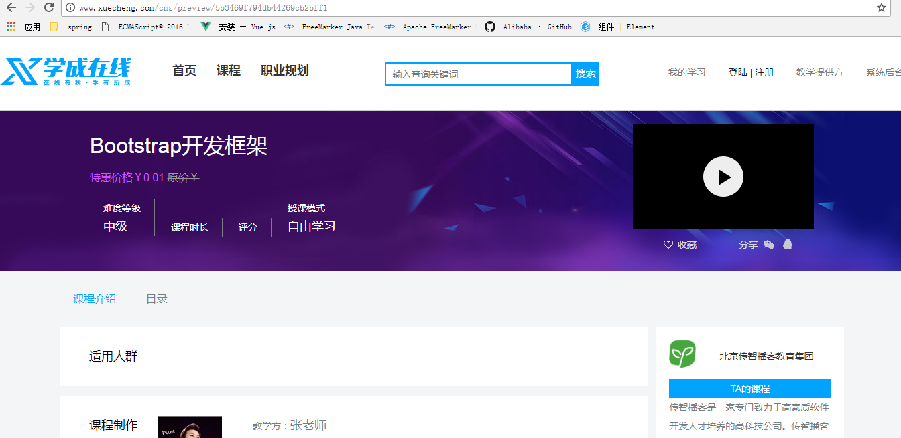

## 6.3 CMS 添加页面接口

cms服务对外提供添加页面接口，实现：如果不存在页面则添加，否则就更新页面信息。

此接口由课程管理服务在课程预览时调用。

### 6.3.1 Api接口

```java
@ApiOperation(" 保存页面")
public CmsPageResult save(CmsPage cmsPage);
```

### 6.3.2 Service

```java
// 添加页面，如果已存在则更新页面
public CmsPageResult save(CmsPage cmsPage){
    //校验页面是否存在，根据页面名称、站点Id、页面webpath查询
    CmsPage cmsPage1 =
cmsPageRepository.findByPageNameAndSiteIdAndPageWebPath(cmsPage.getPageName(),
cmsPage.getSiteId(), cmsPage.getPageWebPath());
    if(cmsPage1 !=null){
        //更新
        return this.update(cmsPage1.getPageId(),cmsPage);
    }else{
        //添加
        return this.add(cmsPage);
    }
}
```

### 6.3.3 Controller

```java
@Override
@PostMapping("/save")
public CmsPageResult save(@RequestBody CmsPage cmsPage) {
    return pageService.save(cmsPage);
}
```

## 6.4 课程预览服务端

### 6.4.1 Api定义

此Api是课程管理前端请求服务端进行课程预览的Api

请求：课程Id

响应：课程预览Url

1. 定义响应类型

```java
@Data
@ToString
@NoArgsConstructor
public class CoursePublishResult extends ResponseResult {
    String previewUrl;
    public CoursePublishResult(ResultCode resultCode,String previewUrl) {
        super(resultCode);
        this.previewUrl = previewUrl;
    }
}
```

2. 接口定义如下

```java
@ApiOperation("预览课程")
public CoursePublishResult preview(String id);
```

### 6.4.2 创建 Feign Client

在课程管理工程创建CMS服务的Feign Client，通过此Client远程请求cms添加页面。

```java
@FeignClient(value = XcServiceList.XC_SERVICE_MANAGE_CMS) 
public interface CmsPageClient{
    //保存页面
    @PostMapping("/cms/page/save")
    public CmsPageResult save(@RequestBody CmsPage cmsPage);
}
```

### 6.4.3 Service

1. 配置添加页面参数信息

   在application.yml中配置：

```yaml
course‐publish:
  siteId: 5b30cba5f58b4411fc6cb1e5
  templateId: 5b345a6b94db44269cb2bfec
  previewUrl: http://www.xuecheng.com/cms/preview/
  pageWebPath: /course/detail/
  pagePhysicalPath: /course/detail/
  dataUrlPre: http://localhost:31200/course/courseview/
```

2. 代码如下：

```java
@Value("${course‐publish.dataUrlPre}")
private String publish_dataUrlPre;
@Value("${course‐publish.pagePhysicalPath}")
private String publish_page_physicalpath;
@Value("${course‐publish.pageWebPath}")
private String publish_page_webpath;
@Value("${course‐publish.siteId}")
private String publish_siteId;
@Value("${course‐publish.templateId}")
private String publish_templateId;
@Value("${course‐publish.previewUrl}")
private String previewUrl;

//根据id查询课程基本信息
public CourseBase findCourseBaseById(String courseId){
    Optional<CourseBase> baseOptional = courseBaseRepository.findById(courseId);
    if(baseOptional.isPresent()){
                    CourseBase courseBase = baseOptional.get();
            return courseBase;
        }
        ExceptionCast.cast(CourseCode.COURSE_GET_NOTEXISTS);
        return null;
    }

//课程预览
public CoursePublishResult preview(String courseId){
    CourseBase one = this.findCourseBaseById(courseId);
    //发布课程预览页面
    CmsPage cmsPage = new CmsPage();
    //站点
    cmsPage.setSiteId(publish_siteId);//课程预览站点
    //模板
    cmsPage.setTemplateId(publish_templateId);
    //页面名称
    cmsPage.setPageName(courseId+".html");
    //页面别名
    cmsPage.setPageAliase(one.getName());
    //页面访问路径
    cmsPage.setPageWebPath(publish_page_webpath);
    //页面存储路径
    cmsPage.setPagePhysicalPath(publish_page_physicalpath);
    //数据url
    cmsPage.setDataUrl(publish_dataUrlPre+courseId);
    //远程请求cms保存页面信息
    CmsPageResult cmsPageResult = cmsPageClient.save(cmsPage);
    if(!cmsPageResult.isSuccess()){
        return new CoursePublishResult(CommonCode.FAIL,null);
    }
    //页面id
    String pageId = cmsPageResult.getCmsPage().getPageId();
    //页面url
    String pageUrl = previewUrl+pageId;
    return new CoursePublishResult(CommonCode.SUCCESS,pageUrl);
}
```

### 6.4.4 Controller

```java
@Override
@PostMapping("/preview/{id}")
public CoursePublishResult preview(@PathVariable("id") String id) {
    return courseService.preview(id);
}
```

## 6.5 前端开发

## 6.5.1 API 方法

```javascript
/*预览课程*/
export const preview = id => {
  return http.requestPost(apiUrl+'/course/preview/'+id);
}
```

### 6.5.2 页面

创建 course_pub.vue

```html
<template> 
  <div>
    <el‐card class="box‐card">
      <div slot="header" class="clearfix">
        <span>课程预览</span>
      </div>
      <div class="text item">
        <el‐button type="primary"  @click.native="preview" >课程预览</el‐button>
        <br/><br/>
        <span v‐if="previewurl && previewurl!=''"><a :href="previewurl" target="_blank">点我查看课
程预览页面 </a> </span>
      </div>
    </el‐card>
  </div>
</template>
```

数据对象：

```javascript
data() { 
  return {
    dotype:'',
    courseid:'',
    course: {"id":"","name":"","status":""},
    previewurl:''
  }
```

方法 ：

```javascript
// 预览
preview(){
  courseApi.preview(this.courseid).then((res) => {
    if(res.success){
      this.$message.error('预览页面生成成功，请点击下方预览链接');
     	if(res.url){ 
        	//预览url
        	this.previewurl = res.url
        }
    }else{
      this.$message.error(res.message);
    }
  });
}
```

